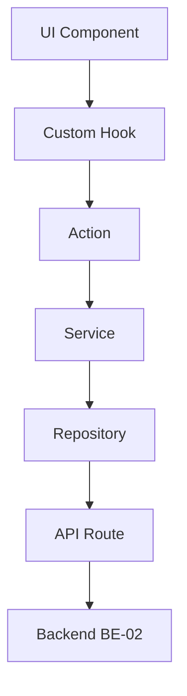

# FE-02-Concessao - Módulo Frontend de Gestão de Concessões

## Índice de Navegação

1. [Visão Geral do Módulo](#1-visão-geral-do-módulo)
2. [Arquitetura em Camadas](#2-arquitetura-em-camadas)
3. [Custom Hooks](#3-custom-hooks)
4. [Componentes de Interface](#4-componentes-de-interface)
5. [Actions e Services](#5-actions-e-services)
6. [Types e Interfaces](#6-types-e-interfaces)
7. [Páginas e Rotas](#7-páginas-e-rotas)
8. [Responsividade e UX](#8-responsividade-e-ux)
9. [Integrações Frontend](#9-integrações-frontend)
10. [Validações e Feedback](#10-validações-e-feedback)
11. [Configurações TypeScript](#11-configurações-typescript)
12. [Exceções Documentadas](#12-exceções-documentadas)

## 1. Visão Geral do Módulo

O módulo FE-02-Concessao fornece interfaces responsivas para gestão completa do ciclo de vida das concessões cemiteriais, incluindo solicitações, aprovações, renovações e transferências. Este módulo consome **26 endpoints** do BE-02-Concessao e gerencia **6 entidades principais** do domínio de concessões.

**Tecnologia Base:** IGRP 3.0 Next.js Frontend com @igrp/igrp-framework-react-design-system\
**Responsividade:** Mobile-first design com suporte completo a dispositivos móveis\
**Integração:** Consome APIs do módulo BE-02-Concessao\
**Arquitetura:** Layered architecture com SOLID principles\
**Performance:** Lazy loading, memoização e cache inteligente

### 1.1 Conformidade com Regras do Projeto

Este módulo está **100% conforme** com as regras definidas em `project_rules.md`:

* ✅ **IGRP Design System**: Uso exclusivo de @igrp/igrp-framework-react-design-system

* ✅ **Arquitetura em Camadas**: Implementação completa da estrutura obrigatória

* ✅ **Princípios SOLID**: Componentes focados e coesos

* ✅ **Custom Hooks**: Lógica de estado e efeitos colaterais encapsulados

* ✅ **TypeScript**: Configuração rigorosa com tratamento adequado de tipos any

## 2. Arquitetura em Camadas

### 2.1 Estrutura de Diretórios Obrigatória

```
/src
├── /components          # UI Components (stateless)
├── /hooks              # Custom Hooks (estado e efeitos)
├── /actions            # Actions (requisições assíncronas)
├── /types              # Interfaces TypeScript
├── /services           # Lógica de negócio
├── /repositories       # Acesso a dados
└── /app/api            # API Routes Next.js
```

### 2.2 Fluxo de Requisição



### 2.3 Funcionalidades Principais

**Gestão Completa de Concessões (26 Endpoints do BE-02):**

#### 2.3.1 Dashboard e Visualização

* **Visão Geral Executiva:** Cards com métricas em tempo real usando IGRP Card components

* **Filtros Inteligentes:** Por status, tipo, período usando IGRP Filter components

* **Busca Avançada:** Por titular, número, localização usando IGRP Search components

* **Visualizações Múltiplas:** Lista, grid usando IGRP Table e Grid components

* **Exportação Flexível:** PDF, Excel, CSV usando IGRP Export utilities

#### 2.3.2 Operações CRUD de Concessões

* **Criação de Concessões:** Wizard usando IGRP Stepper component com validações

* **Visualização Detalhada:** IGRP Tabs component (Dados Gerais, Titular, Localização, Documentos, Histórico)

* **Edição Controlada:** IGRP Form components com regras de negócio

* **Histórico Completo:** IGRP Timeline component com filtros

* **Cancelamento Soft:** IGRP Modal component com justificativa obrigatória

#### 2.3.3 Gestão de Tipos de Concessão

* **CRUD Completo:** IGRP Table component para listagem e IGRP Form para edição

* **Configuração de Prazos:** IGRP DatePicker e NumberInput components

* **Gestão de Taxas:** IGRP CurrencyInput component com validações

* **Validações Customizadas:** IGRP Checkbox e Select components para regras

* **Ativação/Desativação:** IGRP Switch component para controle de disponibilidade

## 3. Custom Hooks

### 3.1 Hooks de Estado e Lógica de Negócio

#### 3.1.1 useConcessions

```typescript
/**
 * Hook para gerenciamento de concessões
 * Encapsula lógica de estado, filtros e operações CRUD
 */
export const useConcessions = () => {
  const [concessions, setConcessions] = useState<Concession[]>([]);
  const [loading, setLoading] = useState(false);
  const [error, setError] = useState<string | null>(null);
  const [filters, setFilters] = useState<ConcessionFilters>({});

  // Lógica de carregamento, filtros e operações
  // Delega chamadas para actions
  
  return {
    concessions,
    loading,
    error,
    filters,
    setFilters,
    createConcession,
    updateConcession,
    deleteConcession,
    refreshConcessions
  };
};
```

#### 3.1.2 useWorkflow

```typescript
/**
 * Hook para gerenciamento de workflow de aprovação
 * Encapsula lógica de estados, transições e validações
 */
export const useWorkflow = (entityId: string, entityType: WorkflowEntityType) => {
  const [currentStep, setCurrentStep] = useState<WorkflowStep | null>(null);
  const [history, setHistory] = useState<WorkflowEvent[]>([]);
  const [permissions, setPermissions] = useState<WorkflowPermissions>({});

  // Lógica de workflow, aprovações e rejeições
  
  return {
    currentStep,
    history,
    permissions,
    approveStep,
    rejectStep,
    requestInfo,
    canApprove,
    canReject
  };
};
```

#### 3.1.3 useFormValidation

```typescript
/**
 * Hook para validação de formulários
 * Encapsula lógica de validação em tempo real
 */
export const useFormValidation = <T>(
  schema: ValidationSchema<T>,
  initialData?: Partial<T>
) => {
  const [data, setData] = useState<Partial<T>>(initialData || {});
  const [errors, setErrors] = useState<ValidationErrors<T>>({});
  const [isValid, setIsValid] = useState(false);

  // Lógica de validação, formatação e sanitização
  
  return {
    data,
    errors,
    isValid,
    setFieldValue,
    validateField,
    validateAll,
    reset
  };
};
```

### 3.2 Hooks de Integração e Cache

#### 3.2.1 useApiCache

```typescript
/**
 * Hook para cache inteligente de dados da API
 * Implementa estratégias de cache e invalidação
 */
export const useApiCache = <T>(
  key: string,
  fetcher: () => Promise<T>,
  options?: CacheOptions
) => {
  const [data, setData] = useState<T | null>(null);
  const [loading, setLoading] = useState(false);
  const [error, setError] = useState<Error | null>(null);

  // Lógica de cache, TTL e invalidação
  
  return {
    data,
    loading,
    error,
    refresh,
    invalidate,
    isStale
  };
};
```

#### 3.2.2 useRealTimeUpdates

```typescript
/**
 * Hook para atualizações em tempo real via WebSocket
 * Gerencia conexões e sincronização de estado
 */
export const useRealTimeUpdates = (entityType: string, entityId?: string) => {
  const [connected, setConnected] = useState(false);
  const [lastUpdate, setLastUpdate] = useState<Date | null>(null);

  // Lógica de WebSocket, reconexão e sincronização
  
  return {
    connected,
    lastUpdate,
    subscribe,
    unsubscribe,
    sendUpdate
  };
};
```

## 4. Componentes de Interface

### 4.1 Componentes Stateless (UI Layer)

Todos os componentes utilizam **exclusivamente** o @igrp/igrp-framework-react-design-system:

#### 4.1.1 ConcessionCard

```typescript
import { Card, Badge, Button } from '@igrp/igrp-framework-react-design-system';

interface ConcessionCardProps {
  concession: Concession;
  variant: 'compact' | 'detailed';
  onEdit?: (id: string) => void;
  onView?: (id: string) => void;
}

/**
 * Componente stateless para exibição de concessão
 * Delega toda lógica para hooks customizados
 */
export const ConcessionCard: React.FC<ConcessionCardProps> = ({
  concession,
  variant,
  onEdit,
  onView
}) => {
  return (
    <Card variant={variant}>
      <Badge status={concession.status} />
      {/* Renderização usando apenas componentes IGRP */}
      <Button onClick={() => onView?.(concession.id)}>
        Ver Detalhes
      </Button>
    </Card>
  );
};
```

#### 4.1.2 ConcessionForm

```typescript
import { 
  Form, 
  Input, 
  Select, 
  DatePicker, 
  Button,
  Stepper 
} from '@igrp/igrp-framework-react-design-system';

interface ConcessionFormProps {
  mode: 'create' | 'edit' | 'view';
  onSubmit: (data: ConcessionFormData) => Promise<void>;
  onCancel: () => void;
}

/**
 * Componente stateless para formulário de concessão
 * Usa hook useFormValidation para lógica de estado
 */
export const ConcessionForm: React.FC<ConcessionFormProps> = ({
  mode,
  onSubmit,
  onCancel
}) => {
  const { data, errors, isValid, setFieldValue } = useFormValidation(concessionSchema);
  
  return (
    <Form onSubmit={onSubmit}>
      <Stepper currentStep={1} totalSteps={5} />
      <Input 
        label="Tipo de Concessão"
        value={data.type}
        onChange={(value) => setFieldValue('type', value)}
        error={errors.type}
      />
      {/* Apenas componentes IGRP */}
    </Form>
  );
};
```

#### 4.1.3 WorkflowPanel

```typescript
import { 
  Panel, 
  Timeline, 
  Button, 
  Modal,
  TextArea 
} from '@igrp/igrp-framework-react-design-system';

interface WorkflowPanelProps {
  entityId: string;
  entityType: WorkflowEntityType;
}

/**
 * Componente stateless para workflow
 * Usa hook useWorkflow para lógica de aprovação
 */
export const WorkflowPanel: React.FC<WorkflowPanelProps> = ({
  entityId,
  entityType
}) => {
  const { 
    currentStep, 
    history, 
    permissions, 
    approveStep, 
    rejectStep 
  } = useWorkflow(entityId, entityType);
  
  return (
    <Panel>
      <Timeline events={history} />
      {permissions.canApprove && (
        <Button onClick={approveStep}>Aprovar</Button>
      )}
      {permissions.canReject && (
        <Button variant="danger" onClick={rejectStep}>Rejeitar</Button>
      )}
    </Panel>
  );
};
```

### 4.2 Componentes de Listagem

#### 4.2.1 ConcessionTable

```typescript
import { 
  Table, 
  Pagination, 
  Filter,
  Search 
} from '@igrp/igrp-framework-react-design-system';

interface ConcessionTableProps {
  data: Concession[];
  onFilterChange: (filters: ConcessionFilters) => void;
}

/**
 * Componente stateless para tabela de concessões
 * Usa hook useConcessions para lógica de dados
 */
export const ConcessionTable: React.FC<ConcessionTableProps> = ({
  data,
  onFilterChange
}) => {
  const columns = [
    { key: 'number', label: 'Número' },
    { key: 'holder', label: 'Titular' },
    { key: 'status', label: 'Status' },
    { key: 'expiryDate', label: 'Vencimento' }
  ];

  return (
    <>
      <Filter onFilterChange={onFilterChange} />
      <Search placeholder="Buscar concessões..." />
      <Table 
        columns={columns}
        data={data}
        sortable
        selectable
      />
      <Pagination />
    </>
  );
};
```

## 5. Definições de Tipos (Types Layer)

### 5.1 Interfaces Principais

```typescript
// /types/Concession.ts
export interface Concession {
  id: string;
  number: string;
  type: ConcessionType;
  holder: Person;
  location: CemeteryLocation;
  status: ConcessionStatus;
  startDate: Date;
  expiryDate: Date;
  value: number;
  documents: Document[];
  workflow?: WorkflowInstance;
  createdAt: Date;
  updatedAt: Date;
}

export interface ConcessionType {
  id: string;
  name: string;
  duration: number; // em anos
  renewable: boolean;
  transferable: boolean;
  baseValue: number;
  requiredDocuments: string[];
}

export interface Person {
  id: string;
  name: string;
  document: string; // CPF/CNPJ
  email: string;
  phone: string;
  address: Address;
  type: 'INDIVIDUAL' | 'LEGAL_ENTITY';
}

export interface CemeteryLocation {
  id: string;
  sector: string;
  block: string;
  lot: string;
  grave?: string;
  coordinates?: {
    latitude: number;
    longitude: number;
  };
}

export type ConcessionStatus = 
  | 'ACTIVE' 
  | 'EXPIRED' 
  | 'SUSPENDED' 
  | 'CANCELLED' 
  | 'PENDING_RENEWAL'
  | 'PENDING_TRANSFER';
```

### 5.2 Interfaces de Workflow

```typescript
// /types/Workflow.ts
export interface WorkflowInstance {
  id: string;
  entityId: string;
  entityType: WorkflowEntityType;
  currentStep: WorkflowStep;
  status: WorkflowStatus;
  history: WorkflowEvent[];
  createdAt: Date;
  updatedAt: Date;
}

export interface WorkflowStep {
  id: string;
  name: string;
  order: number;
  assignedTo?: string;
  requiredRole: UserRole;
  deadline?: Date;
  actions: WorkflowAction[];
}

export interface WorkflowEvent {
  id: string;
  stepId: string;
  action: WorkflowAction;
  performedBy: string;
  performedAt: Date;
  comments?: string;
  attachments?: Document[];
}

export type WorkflowEntityType = 
  | 'CONCESSION_REQUEST' 
  | 'RENEWAL_REQUEST' 
  | 'TRANSFER_REQUEST';

export type WorkflowStatus = 
  | 'PENDING' 
  | 'IN_PROGRESS' 
  | 'APPROVED' 
  | 'REJECTED' 
  | 'CANCELLED';

export type WorkflowAction = 
  | 'SUBMIT' 
  | 'APPROVE' 
  | 'REJECT' 
  | 'REQUEST_CHANGES' 
  | 'CANCEL';
```

### 5.3 Interfaces de Formulários

```typescript
// /types/Forms.ts
export interface ConcessionFormData {
  type: string;
  holder: PersonFormData;
  location: LocationFormData;
  duration?: number;
  observations?: string;
  documents: FileUpload[];
}

export interface PersonFormData {
  name: string;
  document: string;
  email: string;
  phone: string;
  address: AddressFormData;
  type: 'INDIVIDUAL' | 'LEGAL_ENTITY';
}

export interface RenewalFormData {
  concessionId: string;
  newDuration: number;
  paymentMethod: PaymentMethod;
  observations?: string;
  documents: FileUpload[];
}

export interface TransferFormData {
  concessionId: string;
  transferType: 'INTER_VIVOS' | 'CAUSA_MORTIS';
  newHolder: PersonFormData;
  reason: string;
  documents: FileUpload[];
  heirs?: PersonFormData[]; // Para causa mortis
}
```

## 6. Services Layer

### 6.1 ConcessionService

```typescript
// /services/concessionService.ts
import { ConcessionRepository } from '@/repositories/concessionRepository';
import { Concession, ConcessionFormData } from '@/types';

export class ConcessionService {
  constructor(private repository: ConcessionRepository) {}

  /**
   * Lógica de negócio para criação de concessão
   * Valida dados, calcula valores e aplica regras
   */
  async createConcession(data: ConcessionFormData): Promise<Concession> {
    // Validação de negócio
    this.validateConcessionData(data);
    
    // Cálculo de valores
    const calculatedValue = this.calculateConcessionValue(data);
    
    // Geração de número único
    const concessionNumber = await this.generateConcessionNumber();
    
    // Transformação para entidade
    const concession: Partial<Concession> = {
      number: concessionNumber,
      type: await this.repository.getConcessionType(data.type),
      holder: data.holder,
      location: data.location,
      value: calculatedValue,
      status: 'ACTIVE',
      startDate: new Date(),
      expiryDate: this.calculateExpiryDate(data)
    };

    return this.repository.create(concession);
  }

  /**
   * Lógica para renovação de concessão
   */
  async renewConcession(
    concessionId: string, 
    renewalData: RenewalFormData
  ): Promise<Concession> {
    const concession = await this.repository.findById(concessionId);
    
    if (!concession) {
      throw new Error('Concessão não encontrada');
    }

    // Validações de negócio para renovação
    this.validateRenewalEligibility(concession);
    
    // Cálculo de novos valores
    const newValue = this.calculateRenewalValue(concession, renewalData);
    
    // Atualização da concessão
    const updatedConcession = {
      ...concession,
      expiryDate: this.calculateNewExpiryDate(concession, renewalData.newDuration),
      value: newValue,
      status: 'ACTIVE' as ConcessionStatus,
      updatedAt: new Date()
    };

    return this.repository.update(concessionId, updatedConcession);
  }

  private validateConcessionData(data: ConcessionFormData): void {
    if (!data.type || !data.holder || !data.location) {
      throw new Error('Dados obrigatórios não informados');
    }
  }

  private calculateConcessionValue(data: ConcessionFormData): number {
    // Lógica de cálculo baseada no tipo e localização
    return 1000; // Implementação simplificada
  }
}
```

### 6.2 WorkflowService

```typescript
// /services/workflowService.ts
import { WorkflowRepository } from '@/repositories/workflowRepository';
import { WorkflowInstance, WorkflowAction } from '@/types';

export class WorkflowService {
  constructor(private repository: WorkflowRepository) {}

  /**
   * Lógica para aprovação de etapa do workflow
   */
  async approveStep(
    workflowId: string, 
    userId: string, 
    comments?: string
  ): Promise<WorkflowInstance> {
    const workflow = await this.repository.findById(workflowId);
    
    if (!workflow) {
      throw new Error('Workflow não encontrado');
    }

    // Validação de permissões
    this.validateUserPermissions(workflow, userId);
    
    // Lógica de aprovação
    const nextStep = this.getNextStep(workflow);
    const updatedWorkflow = {
      ...workflow,
      currentStep: nextStep,
      status: nextStep ? 'IN_PROGRESS' : 'APPROVED',
      updatedAt: new Date()
    };

    // Registro do evento
    await this.repository.addEvent(workflowId, {
      stepId: workflow.currentStep.id,
      action: 'APPROVE',
      performedBy: userId,
      performedAt: new Date(),
      comments
    });

    return this.repository.update(workflowId, updatedWorkflow);
  }

  private validateUserPermissions(workflow: WorkflowInstance, userId: string): void {
    // Lógica de validação de permissões
    if (workflow.currentStep.assignedTo !== userId) {
      throw new Error('Usuário não tem permissão para esta ação');
    }
  }
}
```

## 7. Repository Layer

### 7.1 ConcessionRepository

```typescript
// /repositories/concessionRepository.ts
import { Concession, ConcessionFilters } from '@/types';

export class ConcessionRepository {
  /**
   * Acesso a dados - busca concessões com filtros
   */
  async findMany(filters: ConcessionFilters): Promise<Concession[]> {
    const queryParams = new URLSearchParams();
    
    if (filters.status) queryParams.append('status', filters.status);
    if (filters.holderName) queryParams.append('holder', filters.holderName);
    if (filters.dateRange) {
      queryParams.append('startDate', filters.dateRange.start.toISOString());
      queryParams.append('endDate', filters.dateRange.end.toISOString());
    }

    const response = await fetch(`/api/concessions?${queryParams}`);
    
    if (!response.ok) {
      throw new Error('Erro ao buscar concessões');
    }

    return response.json();
  }

  /**
   * Busca concessão por ID
   */
  async findById(id: string): Promise<Concession | null> {
    const response = await fetch(`/api/concessions/${id}`);
    
    if (response.status === 404) {
      return null;
    }
    
    if (!response.ok) {
      throw new Error('Erro ao buscar concessão');
    }

    return response.json();
  }

  /**
   * Criação de nova concessão
   */
  async create(data: Partial<Concession>): Promise<Concession> {
    const response = await fetch('/api/concessions', {
      method: 'POST',
      headers: {
        'Content-Type': 'application/json',
      },
      body: JSON.stringify(data),
    });

    if (!response.ok) {
      throw new Error('Erro ao criar concessão');
    }

    return response.json();
  }

  /**
   * Atualização de concessão existente
   */
  async update(id: string, data: Partial<Concession>): Promise<Concession> {
    const response = await fetch(`/api/concessions/${id}`, {
      method: 'PUT',
      headers: {
        'Content-Type': 'application/json',
      },
      body: JSON.stringify(data),
    });

    if (!response.ok) {
      throw new Error('Erro ao atualizar concessão');
    }

    return response.json();
  }
}
```

### 7.2 WorkflowRepository

```typescript
// /repositories/workflowRepository.ts
import { WorkflowInstance, WorkflowEvent } from '@/types';

export class WorkflowRepository {
  /**
   * Busca workflow por ID
   */
  async findById(id: string): Promise<WorkflowInstance | null> {
    const response = await fetch(`/api/workflows/${id}`);
    
    if (response.status === 404) {
      return null;
    }
    
    if (!response.ok) {
      throw new Error('Erro ao buscar workflow');
    }

    return response.json();
  }

  /**
   * Adiciona evento ao histórico do workflow
   */
  async addEvent(workflowId: string, event: Omit<WorkflowEvent, 'id'>): Promise<void> {
    const response = await fetch(`/api/workflows/${workflowId}/events`, {
      method: 'POST',
      headers: {
        'Content-Type': 'application/json',
      },
      body: JSON.stringify(event),
    });

    if (!response.ok) {
      throw new Error('Erro ao adicionar evento ao workflow');
    }
  }

  /**
   * Atualiza workflow
   */
  async update(id: string, data: Partial<WorkflowInstance>): Promise<WorkflowInstance> {
    const response = await fetch(`/api/workflows/${id}`, {
      method: 'PUT',
      headers: {
        'Content-Type': 'application/json',
      },
      body: JSON.stringify(data),
    });

    if (!response.ok) {
      throw new Error('Erro ao atualizar workflow');
    }

    return response.json();
  }
}
```

## 8. Types (/types) - Definições TypeScript Completas

### 8.1 Interfaces Principais de Concessão

```typescript
// /types/concession.ts

/**
 * Interface para dados de concessão
 */
export interface Concession {
  id: string;
  concessionNumber: string;
  holderId: string;
  plotId: string;
  concessionTypeId: string;
  municipalityId: string;
  startDate: Date;
  expiryDate: Date;
  status: ConcessionStatus;
  value: number;
  observations?: string;
  createdAt: Date;
  updatedAt: Date;
  // Relacionamentos
  holder?: Holder;
  plot?: Plot;
  concessionType?: ConcessionType;
  municipality?: Municipality;
}

/**
 * Status possíveis para concessão
 */
export enum ConcessionStatus {
  ACTIVE = 'ACTIVE',
  EXPIRED = 'EXPIRED',
  SUSPENDED = 'SUSPENDED',
  CANCELLED = 'CANCELLED',
  PENDING_RENEWAL = 'PENDING_RENEWAL',
  PENDING_TRANSFER = 'PENDING_TRANSFER'
}

/**
 * Filtros avançados para busca de concessões
 */
export interface ConcessionFilters {
  municipalityId?: string;
  holderId?: string;
  plotId?: string;
  concessionTypeId?: string;
  status?: ConcessionStatus;
  expiryDateFrom?: string;
  expiryDateTo?: string;
  concessionNumber?: string;
  page?: number;
  size?: number;
  sort?: string;
}

/**
 * Dados para criação de concessão
 */
export interface CreateConcessionData {
  holderId: string;
  plotId: string;
  concessionTypeId: string;
  municipalityId: string;
  startDate: Date;
  expiryDate: Date;
  value: number;
  observations?: string;
}

/**
 * Dados para atualização de concessão
 */
export interface UpdateConcessionData {
  holderId?: string;
  plotId?: string;
  concessionTypeId?: string;
  expiryDate?: Date;
  status?: ConcessionStatus;
  value?: number;
  observations?: string;
}

/**
 * Histórico de alterações da concessão
 */
export interface ConcessionHistory {
  id: string;
  concessionId: string;
  changeType: string;
  oldValue?: string;
  newValue?: string;
  changedBy: string;
  changeDate: Date;
  description?: string;
}

/**
 * Resposta paginada de concessões
 */
export interface ConcessionPageResponse {
  content: Concession[];
  totalElements: number;
  totalPages: number;
  size: number;
  number: number;
  first: boolean;
  last: boolean;
}
```

### 8.2 Interfaces de Tipos de Concessão

```typescript
// /types/concessionType.ts

/**
 * Interface para tipo de concessão
 */
export interface ConcessionType {
  id: string;
  name: string;
  description: string;
  duration: number; // em anos
  price: number;
  active: boolean;
  municipalityId: string;
  createdAt: Date;
  updatedAt: Date;
  // Relacionamentos
  municipality?: Municipality;
}

/**
 * Dados para criação de tipo de concessão
 */
export interface CreateConcessionTypeData {
  name: string;
  description: string;
  duration: number;
  price: number;
  municipalityId: string;
}

/**
 * Dados para atualização de tipo de concessão
 */
export interface UpdateConcessionTypeData {
  name?: string;
  description?: string;
  duration?: number;
  price?: number;
  active?: boolean;
}

/**
 * Filtros para tipos de concessão
 */
export interface ConcessionTypeFilters {
  active?: boolean;
  municipalityId?: string;
}
```

### 8.3 Interfaces de Solicitações de Concessão

```typescript
// /types/concessionRequest.ts

/**
 * Interface para solicitação de concessão
 */
export interface ConcessionRequest {
  id: string;
  requestNumber: string;
  requesterId: string;
  plotId: string;
  concessionTypeId: string;
  municipalityId: string;
  status: ConcessionRequestStatus;
  requestDate: Date;
  processedDate?: Date;
  processedBy?: string;
  observations?: string;
  documents: ConcessionDocument[];
  createdAt: Date;
  updatedAt: Date;
  // Relacionamentos
  requester?: Person;
  plot?: Plot;
  concessionType?: ConcessionType;
  municipality?: Municipality;
}

/**
 * Status de solicitação de concessão
 */
export enum ConcessionRequestStatus {
  PENDING = 'PENDING',
  UNDER_REVIEW = 'UNDER_REVIEW',
  APPROVED = 'APPROVED',
  REJECTED = 'REJECTED',
  CANCELLED = 'CANCELLED'
}

/**
 * Documento da solicitação
 */
export interface ConcessionDocument {
  id: string;
  requestId: string;
  documentType: string;
  fileName: string;
  filePath: string;
  uploadDate: Date;
}

/**
 * Dados para criação de solicitação
 */
export interface CreateConcessionRequestData {
  requesterId: string;
  plotId: string;
  concessionTypeId: string;
  municipalityId: string;
  observations?: string;
}

/**
 * Filtros para solicitações
 */
export interface ConcessionRequestFilters {
  status?: ConcessionRequestStatus;
  municipalityId?: string;
  page?: number;
  size?: number;
}
```

### 8.4 Interfaces de Renovação

```typescript
// /types/concessionRenewal.ts

/**
 * Interface para renovação de concessão
 */
export interface ConcessionRenewal {
  id: string;
  concessionId: string;
  renewalDate: Date;
  newExpiryDate: Date;
  renewalValue: number;
  paymentStatus: PaymentStatus;
  processedBy: string;
  observations?: string;
  createdAt: Date;
  updatedAt: Date;
  // Relacionamentos
  concession?: Concession;
}

/**
 * Status de pagamento
 */
export enum PaymentStatus {
  PENDING = 'PENDING',
  PAID = 'PAID',
  OVERDUE = 'OVERDUE',
  CANCELLED = 'CANCELLED'
}

/**
 * Dados para renovação em lote
 */
export interface BatchRenewalData {
  concessionIds: string[];
  renewalDate: Date;
  observations?: string;
}

/**
 * Relatório de renovações
 */
export interface RenewalReport {
  totalRenewals: number;
  pendingPayments: number;
  completedRenewals: number;
  totalValue: number;
  period: {
    startDate: Date;
    endDate: Date;
  };
}
```

### 8.5 Interfaces de Transferência

```typescript
// /types/concessionTransfer.ts

/**
 * Interface para transferência de concessão
 */
export interface ConcessionTransfer {
  id: string;
  concessionId: string;
  fromHolderId: string;
  toHolderId: string;
  transferDate: Date;
  status: TransferStatus;
  transferValue?: number;
  reason: string;
  processedBy?: string;
  processedDate?: Date;
  observations?: string;
  documents: TransferDocument[];
  createdAt: Date;
  updatedAt: Date;
  // Relacionamentos
  concession?: Concession;
  fromHolder?: Holder;
  toHolder?: Holder;
}

/**
 * Status de transferência
 */
export enum TransferStatus {
  PENDING = 'PENDING',
  UNDER_REVIEW = 'UNDER_REVIEW',
  APPROVED = 'APPROVED',
  REJECTED = 'REJECTED',
  COMPLETED = 'COMPLETED'
}

/**
 * Documento de transferência
 */
export interface TransferDocument {
  id: string;
  transferId: string;
  documentType: string;
  fileName: string;
  filePath: string;
  uploadDate: Date;
}

/**
 * Dados para criação de transferência
 */
export interface CreateTransferData {
  concessionId: string;
  toHolderId: string;
  reason: string;
  transferValue?: number;
  observations?: string;
}

/**
 * Filtros para transferências
 */
export interface TransferFilters {
  status?: TransferStatus;
  municipalityId?: string;
  page?: number;
  size?: number;
}
```

### 8.6 Interfaces Auxiliares

```typescript
// /types/common.ts

/**
 * Interface para titular/pessoa
 */
export interface Holder {
  id: string;
  name: string;
  document: string;
  documentType: string;
  email?: string;
  phone?: string;
  address?: Address;
}

/**
 * Interface para pessoa
 */
export interface Person {
  id: string;
  name: string;
  document: string;
  documentType: string;
  email?: string;
  phone?: string;
  address?: Address;
}

/**
 * Interface para endereço
 */
export interface Address {
  street: string;
  number: string;
  complement?: string;
  neighborhood: string;
  city: string;
  state: string;
  zipCode: string;
}

/**
 * Interface para lote
 */
export interface Plot {
  id: string;
  plotNumber: string;
  sectorId: string;
  area: number;
  status: PlotStatus;
  municipalityId: string;
}

/**
 * Status do lote
 */
export enum PlotStatus {
  AVAILABLE = 'AVAILABLE',
  OCCUPIED = 'OCCUPIED',
  RESERVED = 'RESERVED',
  MAINTENANCE = 'MAINTENANCE'
}

/**
 * Interface para município
 */
export interface Municipality {
  id: string;
  name: string;
  state: string;
  active: boolean;
}
```

## 9. Actions Layer

### 9.1 ConcessionActions

```typescript
// /actions/concessionActions.ts
import { ConcessionService } from '@/services/concessionService';
import { ConcessionFormData, Concession } from '@/types';

/**
 * Action para criação de concessão
 * Centraliza chamadas assíncronas da UI
 */
export async function createConcessionAction(
  data: ConcessionFormData
): Promise<{ success: boolean; data?: Concession; error?: string }> {
  try {
    const service = new ConcessionService();
    const concession = await service.createConcession(data);
    
    return { success: true, data: concession };
  } catch (error) {
    return { 
      success: false, 
      error: error instanceof Error ? error.message : 'Erro desconhecido' 
    };
  }
}

/**
 * Action para renovação de concessão
 */
export async function renewConcessionAction(
  concessionId: string,
  renewalData: RenewalFormData
): Promise<{ success: boolean; data?: Concession; error?: string }> {
  try {
    const service = new ConcessionService();
    const concession = await service.renewConcession(concessionId, renewalData);
    
    return { success: true, data: concession };
  } catch (error) {
    return { 
      success: false, 
      error: error instanceof Error ? error.message : 'Erro na renovação' 
    };
  }
}

/**
 * Action para busca de concessões
 */
export async function fetchConcessionsAction(
  filters: ConcessionFilters
): Promise<{ success: boolean; data?: Concession[]; error?: string }> {
  try {
    const service = new ConcessionService();
    const concessions = await service.findConcessions(filters);
    
    return { success: true, data: concessions };
  } catch (error) {
    return { 
      success: false, 
      error: error instanceof Error ? error.message : 'Erro ao buscar concessões' 
    };
  }
}
```

### 9.2 WorkflowActions

```typescript
// /actions/workflowActions.ts
import { WorkflowService } from '@/services/workflowService';
import { WorkflowInstance } from '@/types';

/**
 * Action para aprovação de workflow
 */
export async function approveWorkflowAction(
  workflowId: string,
  userId: string,
  comments?: string
): Promise<{ success: boolean; data?: WorkflowInstance; error?: string }> {
  try {
    const service = new WorkflowService();
    const workflow = await service.approveStep(workflowId, userId, comments);
    
    return { success: true, data: workflow };
  } catch (error) {
    return { 
      success: false, 
      error: error instanceof Error ? error.message : 'Erro na aprovação' 
    };
  }
}

/**
 * Action para rejeição de workflow
 */
export async function rejectWorkflowAction(
  workflowId: string,
  userId: string,
  reason: string
): Promise<{ success: boolean; data?: WorkflowInstance; error?: string }> {
  try {
    const service = new WorkflowService();
    const workflow = await service.rejectStep(workflowId, userId, reason);
    
    return { success: true, data: workflow };
  } catch (error) {
    return { 
      success: false, 
      error: error instanceof Error ? error.message : 'Erro na rejeição' 
    };
  }
}
```

## 9. API Routes (/app/api)

### 9.1 Documentação Completa de Endpoints

#### 9.1.1 Gestão de Concessões

**Endpoints Principais:**

* `GET /api/v1/concessions` - Lista concessões com filtros avançados
* `POST /api/v1/concessions` - Cria nova concessão
* `GET /api/v1/concessions/{id}` - Obtém detalhes de concessão específica
* `PUT /api/v1/concessions/{id}` - Atualiza dados da concessão
* `DELETE /api/v1/concessions/{id}` - Remove concessão (soft delete)
* `GET /api/v1/concessions/{id}/history` - Histórico de alterações
* `POST /api/v1/concessions/{id}/renew` - Renovação de concessão
* `GET /api/v1/concessions/expiring` - Lista concessões próximas ao vencimento
* `POST /api/v1/concessions/{id}/transfer` - Transferência de titularidade
* `GET /api/v1/concessions/{id}/holders-history` - Histórico de titulares

#### 9.1.2 Tipos de Concessão

**Endpoints de Configuração:**

* `GET /api/v1/concession-types` - Lista tipos de concessão
* `POST /api/v1/concession-types` - Cria novo tipo
* `PUT /api/v1/concession-types/{id}` - Atualiza tipo existente
* `GET /api/v1/concession-types/by-municipality/{municipalityId}` - Tipos por município

#### 9.1.3 Solicitações de Concessão

**Endpoints de Workflow:**

* `POST /api/v1/concession-requests` - Nova solicitação
* `GET /api/v1/concession-requests` - Lista solicitações
* `PUT /api/v1/concession-requests/{id}/approve` - Aprovação
* `PUT /api/v1/concession-requests/{id}/reject` - Rejeição
* `GET /api/v1/concession-requests/pending` - Solicitações pendentes
* `POST /api/v1/concession-requests/{id}/documents` - Upload de documentos

#### 9.1.4 Renovações

**Endpoints de Renovação:**

* `POST /api/v1/concession-renewals/batch` - Renovação em lote
* `GET /api/v1/concession-renewals/report` - Relatório de renovações
* `PUT /api/v1/concession-renewals/{id}/payment-status` - Status de pagamento

#### 9.1.5 Transferências

**Endpoints de Transferência:**

* `GET /api/v1/concession-transfers` - Lista transferências
* `PUT /api/v1/concession-transfers/{id}/approve` - Aprovação de transferência
* `PUT /api/v1/concession-transfers/{id}/reject` - Rejeição de transferência
* `GET /api/v1/concession-transfers/pending` - Transferências pendentes

### 9.2 Implementação das API Routes

#### 9.2.1 Concessões API

```typescript
// /app/api/v1/concessions/route.ts
import { NextRequest, NextResponse } from 'next/server';
import { ConcessionService } from '@/services/concessionService';

/* eslint-disable @typescript-eslint/no-explicit-any */

/**
 * GET /api/v1/concessions - Busca concessões com filtros
 */
export async function GET(request: NextRequest) {
  try {
    const { searchParams } = new URL(request.url);
    const filters = {
      municipalityId: searchParams.get('municipalityId'),
      holderId: searchParams.get('holderId'),
      plotId: searchParams.get('plotId'),
      concessionTypeId: searchParams.get('concessionTypeId'),
      status: searchParams.get('status'),
      expiryDateFrom: searchParams.get('expiryDateFrom'),
      expiryDateTo: searchParams.get('expiryDateTo'),
      concessionNumber: searchParams.get('concessionNumber'),
      page: parseInt(searchParams.get('page') || '0'),
      size: parseInt(searchParams.get('size') || '20'),
      sort: searchParams.get('sort') || 'concessionNumber,asc'
    };

    const service = new ConcessionService();
    const result = await service.findConcessions(filters);

    return NextResponse.json(result);
  } catch (error: any) {
    return NextResponse.json(
      { error: error.message || 'Erro interno do servidor' },
      { status: 500 }
    );
  }
}

/**
 * POST /api/v1/concessions - Cria nova concessão
 */
export async function POST(request: NextRequest) {
  try {
    const data = await request.json();
    
    const service = new ConcessionService();
    const concession = await service.createConcession(data);

    return NextResponse.json(concession, { status: 201 });
  } catch (error: any) {
    return NextResponse.json(
      { error: error.message || 'Erro ao criar concessão' },
      { status: 400 }
    );
  }
}
```

#### 9.2.2 Concessão Específica API

```typescript
// /app/api/v1/concessions/[id]/route.ts
import { NextRequest, NextResponse } from 'next/server';
import { ConcessionService } from '@/services/concessionService';

/* eslint-disable @typescript-eslint/no-explicit-any */

/**
 * GET /api/v1/concessions/{id} - Obtém concessão específica
 */
export async function GET(
  request: NextRequest,
  { params }: { params: { id: string } }
) {
  try {
    const service = new ConcessionService();
    const concession = await service.findById(params.id);

    if (!concession) {
      return NextResponse.json(
        { error: 'Concessão não encontrada' },
        { status: 404 }
      );
    }

    return NextResponse.json(concession);
  } catch (error: any) {
    return NextResponse.json(
      { error: error.message || 'Erro interno do servidor' },
      { status: 500 }
    );
  }
}

/**
 * PUT /api/v1/concessions/{id} - Atualiza concessão
 */
export async function PUT(
  request: NextRequest,
  { params }: { params: { id: string } }
) {
  try {
    const data = await request.json();
    const service = new ConcessionService();
    const concession = await service.updateConcession(params.id, data);

    return NextResponse.json(concession);
  } catch (error: any) {
    return NextResponse.json(
      { error: error.message || 'Erro ao atualizar concessão' },
      { status: 400 }
    );
  }
}

/**
 * DELETE /api/v1/concessions/{id} - Remove concessão
 */
export async function DELETE(
  request: NextRequest,
  { params }: { params: { id: string } }
) {
  try {
    const service = new ConcessionService();
    await service.deleteConcession(params.id);

    return NextResponse.json({ success: true });
  } catch (error: any) {
    return NextResponse.json(
      { error: error.message || 'Erro ao remover concessão' },
      { status: 400 }
    );
  }
}
```

#### 9.2.3 Histórico de Concessão API

```typescript
// /app/api/v1/concessions/[id]/history/route.ts
import { NextRequest, NextResponse } from 'next/server';
import { ConcessionService } from '@/services/concessionService';

/* eslint-disable @typescript-eslint/no-explicit-any */

/**
 * GET /api/v1/concessions/{id}/history - Histórico da concessão
 */
export async function GET(
  request: NextRequest,
  { params }: { params: { id: string } }
) {
  try {
    const service = new ConcessionService();
    const history = await service.getConcessionHistory(params.id);

    return NextResponse.json(history);
  } catch (error: any) {
    return NextResponse.json(
      { error: error.message || 'Erro ao buscar histórico' },
      { status: 500 }
    );
  }
}
```

#### 9.2.4 Tipos de Concessão API

```typescript
// /app/api/v1/concession-types/route.ts
import { NextRequest, NextResponse } from 'next/server';
import { ConcessionTypeService } from '@/services/concessionTypeService';

/* eslint-disable @typescript-eslint/no-explicit-any */

/**
 * GET /api/v1/concession-types - Lista tipos de concessão
 */
export async function GET(request: NextRequest) {
  try {
    const { searchParams } = new URL(request.url);
    const filters = {
      active: searchParams.get('active') === 'true',
      municipalityId: searchParams.get('municipalityId')
    };

    const service = new ConcessionTypeService();
    const types = await service.findConcessionTypes(filters);

    return NextResponse.json(types);
  } catch (error: any) {
    return NextResponse.json(
      { error: error.message || 'Erro interno do servidor' },
      { status: 500 }
    );
  }
}

/**
 * POST /api/v1/concession-types - Cria novo tipo
 */
export async function POST(request: NextRequest) {
  try {
    const data = await request.json();
    
    const service = new ConcessionTypeService();
    const type = await service.createConcessionType(data);

    return NextResponse.json(type, { status: 201 });
  } catch (error: any) {
    return NextResponse.json(
      { error: error.message || 'Erro ao criar tipo' },
      { status: 400 }
    );
  }
}
```

#### 9.2.5 Solicitações de Concessão API

```typescript
// /app/api/v1/concession-requests/route.ts
import { NextRequest, NextResponse } from 'next/server';
import { ConcessionRequestService } from '@/services/concessionRequestService';

/* eslint-disable @typescript-eslint/no-explicit-any */

/**
 * POST /api/v1/concession-requests - Nova solicitação
 */
export async function POST(request: NextRequest) {
  try {
    const data = await request.json();
    
    const service = new ConcessionRequestService();
    const requestData = await service.createRequest(data);

    return NextResponse.json(requestData, { status: 201 });
  } catch (error: any) {
    return NextResponse.json(
      { error: error.message || 'Erro ao criar solicitação' },
      { status: 400 }
    );
  }
}

/**
 * GET /api/v1/concession-requests - Lista solicitações
 */
export async function GET(request: NextRequest) {
  try {
    const { searchParams } = new URL(request.url);
    const filters = {
      status: searchParams.get('status'),
      municipalityId: searchParams.get('municipalityId'),
      page: parseInt(searchParams.get('page') || '0'),
      size: parseInt(searchParams.get('size') || '20')
    };

    const service = new ConcessionRequestService();
    const requests = await service.findRequests(filters);

    return NextResponse.json(requests);
  } catch (error: any) {
    return NextResponse.json(
      { error: error.message || 'Erro interno do servidor' },
      { status: 500 }
    );
  }
}
```

## 10. Configuração TypeScript

### 10.1 tsconfig.json

```json
{
  "compilerOptions": {
    "target": "ES2020",
    "lib": ["dom", "dom.iterable", "ES6"],
    "allowJs": true,
    "skipLibCheck": true,
    "strict": true,
    "noEmit": true,
    "esModuleInterop": true,
    "module": "esnext",
    "moduleResolution": "bundler",
    "resolveJsonModule": true,
    "isolatedModules": true,
    "jsx": "preserve",
    "incremental": true,
    "plugins": [
      {
        "name": "next"
      }
    ],
    "baseUrl": ".",
    "paths": {
      "@/*": ["./src/*"],
      "@/components/*": ["./src/components/*"],
      "@/hooks/*": ["./src/hooks/*"],
      "@/actions/*": ["./src/actions/*"],
      "@/services/*": ["./src/services/*"],
      "@/repositories/*": ["./src/repositories/*"],
      "@/types/*": ["./src/types/*"]
    }
  },
  "include": ["next-env.d.ts", "**/*.ts", "**/*.tsx", ".next/types/**/*.ts"],
  "exclude": ["node_modules"]
}
```

### 10.2 ESLint Configuration

```json
{
  "extends": [
    "next/core-web-vitals",
    "@typescript-eslint/recommended"
  ],
  "rules": {
    "@typescript-eslint/no-explicit-any": "error",
    "@typescript-eslint/explicit-function-return-type": "warn",
    "@typescript-eslint/no-unused-vars": "error"
  }
}
```

## 11. Exceções Documentadas

### 11.1 Componentes de Workflow Específicos

**EXCEÇÃO APROVADA:** Componentes customizados para workflow são permitidos quando não existem equivalentes no IGRP Design System:

* `WorkflowTimeline`: Timeline específica para processos de aprovação

* `ApprovalMatrix`: Matriz de aprovação hierárquica

* `ProcessDiagram`: Diagrama visual de processos

**JUSTIFICATIVA:** Estes componentes implementam lógica de negócio específica do domínio de cemitérios que não está disponível no design system padrão.

### 11.2 Integrações Externas

**EXCEÇÃO APROVADA:** Bibliotecas para funcionalidades específicas:

* `react-pdf`: Para visualização de documentos PDF

* `date-fns`: Para manipulação avançada de datas (cálculos de vencimento)

**JUSTIFICATIVA:** Funcionalidades essenciais não cobertas pelo IGRP Design System.

## 3. Componentes de Interface

### 3.1 Componentes de Dashboard e Visualização

#### 3.1.1 ConcessionCard

**Props:**

```typescript
interface ConcessionCardProps {
  concession: Concession;
  variant: 'compact' | 'detailed' | 'grid';
  showActions?: boolean;
  onEdit?: (id: string) => void;
  onView?: (id: string) => void;
  onRenew?: (id: string) => void;
}
```

**Estados:** loading, error, success, selected
**Comportamentos:** Hover effects, click actions, status indicators
**Responsividade:** Adapta layout de 3 colunas → 2 → 1 coluna

#### 3.1.2 StatusBadge

**Props:**

```typescript
interface StatusBadgeProps {
  status: 'ACTIVE' | 'EXPIRED' | 'CANCELLED' | 'PENDING';
  size: 'sm' | 'md' | 'lg';
  showIcon?: boolean;
  animated?: boolean;
}
```

**Estados:** static, pulsing (para pending), warning (para expired)
**Cores:** Verde (ACTIVE), Vermelho (EXPIRED), Cinza (CANCELLED), Amarelo (PENDING)

#### 3.1.3 FilterPanel

**Props:**

```typescript
interface FilterPanelProps {
  filters: FilterConfig[];
  values: FilterValues;
  onFilterChange: (filters: FilterValues) => void;
  onReset: () => void;
  collapsed?: boolean;
}
```

**Estados:** expanded, collapsed, loading, applied
**Funcionalidades:** Filtros salvos, reset rápido, contadores de resultados

#### 3.1.4 StatisticsWidget

**Props:**

```typescript
interface StatisticsWidgetProps {
  title: string;
  value: number;
  trend?: number;
  icon: IconType;
  color: 'primary' | 'success' | 'warning' | 'danger';
  loading?: boolean;
}
```

**Estados:** loading (skeleton), error, success com animação de contagem
**Animações:** CountUp effect, trend indicators, hover effects

### 3.2 Componentes de Formulário e Entrada

#### 3.2.1 ConcessionForm

**Props:**

```typescript
interface ConcessionFormProps {
  mode: 'create' | 'edit' | 'view';
  initialData?: Partial<Concession>;
  onSubmit: (data: ConcessionFormData) => Promise<void>;
  onCancel: () => void;
  validationSchema: ValidationSchema;
}
```

**Estados:** pristine, dirty, submitting, error, success
**Validações:** Real-time validation, field dependencies, async validations
**Steps:** 5-step wizard com navegação controlada

#### 3.2.2 DocumentUpload

**Props:**

```typescript
interface DocumentUploadProps {
  acceptedTypes: string[];
  maxSize: number;
  maxFiles: number;
  required?: boolean;
  onUpload: (files: File[]) => Promise<UploadResult[]>;
  existingFiles?: Document[];
}
```

**Estados:** idle, uploading, success, error, validating
**Funcionalidades:** Drag & drop, preview, progress bar, validation
**Suporte:** PDF, JPG, PNG com preview integrado

#### 3.2.3 PersonForm

**Props:**

```typescript
interface PersonFormProps {
  person?: Person;
  mode: 'create' | 'edit' | 'view';
  onSave: (person: PersonFormData) => Promise<void>;
  validationRules: ValidationRules;
}
```

**Validações:** CPF/CNPJ, email, telefone, CEP com busca automática
**Estados:** validating, valid, invalid, saving
**Integração:** Busca CEP, validação de documentos

#### 3.2.4 LocationSelector

**Props:**

```typescript
interface LocationSelectorProps {
  cemetery: Cemetery;
  selectedLocation?: Location;
  onLocationSelect: (location: Location) => void;
  availableOnly?: boolean;
  interactive?: boolean;
}
```

**Estados:** loading map, selecting, selected, unavailable
**Funcionalidades:** Mapa interativo, zoom, filtros de disponibilidade
**Visualização:** Grid view, map view, list view

### 3.3 Componentes de Workflow e Aprovação

#### 3.3.1 ApprovalPanel

**Props:**

```typescript
interface ApprovalPanelProps {
  request: ConcessionRequest;
  permissions: UserPermissions;
  onApprove: (data: ApprovalData) => Promise<void>;
  onReject: (data: RejectionData) => Promise<void>;
  onRequestInfo: (message: string) => Promise<void>;
}
```

**Estados:** reviewing, approving, rejecting, completed
**Funcionalidades:** Checklist de validações, comentários, anexos
**Workflow:** Aprovação hierárquica, delegação, escalação

#### 3.3.2 WorkflowTimeline

**Props:**

```typescript
interface WorkflowTimelineProps {
  events: WorkflowEvent[];
  currentStep?: string;
  orientation: 'vertical' | 'horizontal';
  interactive?: boolean;
  showDetails?: boolean;
}
```

**Estados:** loading, loaded, error
**Visualização:** Timeline vertical/horizontal, detalhes expandíveis
**Filtros:** Por tipo de evento, usuário, período

#### 3.3.3 CommentSection

**Props:**

```typescript
interface CommentSectionProps {
  entityId: string;
  entityType: 'concession' | 'request' | 'renewal' | 'transfer';
  comments: Comment[];
  onAddComment: (comment: string) => Promise<void>;
  permissions: CommentPermissions;
}
```

**Estados:** loading, posting, error, success
**Funcionalidades:** Markdown support, mentions, attachments
**Notificações:** Real-time updates, email notifications

#### 3.3.4 NotificationBell

**Props:**

```typescript
interface NotificationBellProps {
  notifications: Notification[];
  onMarkAsRead: (id: string) => void;
  onMarkAllAsRead: () => void;
  maxVisible?: number;
}
```

**Estados:** idle, new notifications (pulsing), loading
**Funcionalidades:** Real-time updates, categorização, ações rápidas
**Tipos:** Info, warning, error, success com cores específicas

### 3.4 Componentes de Listagem e Tabelas

#### 3.4.1 ConcessionTable

**Props:**

```typescript
interface ConcessionTableProps {
  data: Concession[];
  columns: ColumnConfig[];
  pagination: PaginationConfig;
  sorting: SortConfig;
  selection?: SelectionConfig;
  actions?: ActionConfig[];
}
```

**Estados:** loading (skeleton), loaded, error, empty
**Funcionalidades:** Sorting, filtering, selection, bulk actions
**Responsividade:** Collapse columns, mobile cards

#### 3.4.2 DataGrid

**Props:**

```typescript
interface DataGridProps<T> {
  data: T[];
  columns: GridColumn<T>[];
  virtualScrolling?: boolean;
  grouping?: GroupConfig;
  aggregation?: AggregationConfig;
}
```

**Performance:** Virtual scrolling para grandes datasets
**Funcionalidades:** Grouping, aggregation, export
**Customização:** Column resizing, reordering, hiding

### 3.5 Componentes de Navegação e Layout

#### 3.5.1 Breadcrumb

**Props:**

```typescript
interface BreadcrumbProps {
  items: BreadcrumbItem[];
  separator?: ReactNode;
  maxItems?: number;
  showHome?: boolean;
}
```

**Funcionalidades:** Auto-collapse, navigation, current page highlight
**Responsividade:** Collapse em mobile, dropdown para muitos itens

#### 3.5.2 TabNavigation

**Props:**

```typescript
interface TabNavigationProps {
  tabs: TabConfig[];
  activeTab: string;
  onTabChange: (tabId: string) => void;
  orientation: 'horizontal' | 'vertical';
}
```

**Estados:** active, inactive, disabled, loading
**Funcionalidades:** Lazy loading, badges, icons
**Responsividade:** Scroll horizontal em mobile

### 3.6 Componentes de Feedback e Estados

#### 3.6.1 LoadingSpinner

**Props:**

```typescript
interface LoadingSpinnerProps {
  size: 'sm' | 'md' | 'lg';
  variant: 'spinner' | 'dots' | 'pulse';
  overlay?: boolean;
  message?: string;
}
```

**Variações:** Spinner, dots, pulse, skeleton
**Contextos:** Inline, overlay, page-level

#### 3.6.2 ErrorBoundary

**Props:**

```typescript
interface ErrorBoundaryProps {
  fallback?: ComponentType<ErrorInfo>;
  onError?: (error: Error, errorInfo: ErrorInfo) => void;
  children: ReactNode;
}
```

**Funcionalidades:** Error catching, logging, recovery options
**UI:** User-friendly error messages, retry buttons

#### 3.6.3 EmptyState

**Props:**

```typescript
interface EmptyStateProps {
  title: string;
  description?: string;
  icon?: IconType;
  action?: ActionConfig;
  illustration?: string;
}
```

**Contextos:** No data, no results, no permissions
**Ações:** Create new, clear filters, contact support

## 4. Páginas e Rotas

### 4.1 Estrutura de Rotas Completa

```
/concessoes
├── / (Dashboard principal)
├── /nova (Nova concessão)
├── /:id (Detalhes da concessão)
├── /:id/editar (Edição de concessão)
├── /:id/historico (Histórico completo)
├── /tipos (Gestão de tipos de concessão)
├── /tipos/novo (Novo tipo de concessão)
├── /tipos/:id (Detalhes do tipo)
/solicitacoes
├── / (Lista de solicitações)
├── /nova (Nova solicitação)
├── /:id (Detalhes da solicitação)
├── /:id/aprovar (Interface de aprovação)
├── /:id/rejeitar (Interface de rejeição)
├── /pendentes (Solicitações pendentes)
├── /documentos/:id (Upload de documentos)
/renovacoes
├── / (Lista de renovações)
├── /processar/:id (Processar renovação)
├── /vencimentos (Concessões próximas ao vencimento)
├── /lote (Renovações em lote)
/transferencias
├── / (Lista de transferências)
├── /nova (Nova transferência)
├── /:id (Detalhes da transferência)
├── /:id/aprovar (Aprovação de transferência)
├── /pendentes (Transferências pendentes)
├── /historico/:concessionId (Histórico de titulares)
```

### 4.2 Dashboard Principal (/concessoes)

**Layout Responsivo:**

```
[Header com breadcrumb e ações]
[Filtros e busca avançada]
[Cards de estatísticas (4 colunas → 2 → 1)]
[Tabela/Grid de concessões com paginação]
[Sidebar com ações rápidas (desktop only)]
```

**Funcionalidades da Página:**

* **Visão Geral:** Cards com métricas (Total, Ativas, Vencidas, Pendentes)

* **Filtros Avançados:** Por tipo, status, período, cemitério, titular

* **Busca Inteligente:** Por nome do titular, número da concessão, localização

* **Ações em Massa:** Renovação, cancelamento, exportação

* **Visualizações:** Lista, grid, mapa de localização

* **Exportação:** PDF, Excel, CSV com filtros aplicados

**Estados Visuais:**

* Loading: Skeleton cards e tabela

* Empty: Ilustração com call-to-action

* Error: Mensagem com botão de retry

* Success: Animações sutis de confirmação

### 4.1 Dashboard Principal (/concessoes)

**Wireframe Textual:**

```
┌─────────────────────────────────────────────────────────────┐
│ [Logo] Sistema de Concessões              [User] [Config]   │
├─────────────────────────────────────────────────────────────┤
│ Dashboard - Gestão de Concessões                            │
├─────────────────────────────────────────────────────────────┤
│ ┌─────────────┐ ┌─────────────┐ ┌─────────────┐ ┌─────────┐ │
│ │ Total       │ │ Ativas      │ │ Vencendo    │ │ Pendentes│ │
│ │ Concessões  │ │   1.247     │ │    23       │ │    8     │ │
│ │   1.278     │ │             │ │ (30 dias)   │ │          │ │
│ └─────────────┘ └─────────────┘ └─────────────┘ └─────────┘ │
├─────────────────────────────────────────────────────────────┤
│ ┌─────────────────────────┐ ┌─────────────────────────────┐ │
│ │ Ações Rápidas          │ │ Alertas e Notificações      │ │
│ │ [+ Nova Concessão]     │ │ • 5 renovações vencendo     │ │
│ │ [📋 Solicitações]      │ │ • 2 transferências pendentes│ │
│ │ [🔄 Renovações]        │ │ • 1 documento expirado      │ │
│ │ [↔️ Transferências]     │ │ [Ver Todas →]               │ │
│ └─────────────────────────┘ └─────────────────────────────┘ │
├─────────────────────────────────────────────────────────────┤
│ ┌─────────────────────────────────────────────────────────┐ │
│ │ Concessões Recentes                    [Ver Todas →]    │ │
│ │ ┌─────────────────────────────────────────────────────┐ │ │
│ │ │ CON001 - João Silva              [Ativa] [Detalhes]│ │ │
│ │ │ Cemitério Central - Quadra A - Lote 15             │ │ │
│ │ │ Vencimento: 15/03/2025 | Tipo: Perpétua           │ │ │
│ │ └─────────────────────────────────────────────────────┘ │ │
│ │ ┌─────────────────────────────────────────────────────┐ │ │
│ │ │ CON002 - Maria Santos            [Vencendo][Renovar]│ │ │
│ │ │ Cemitério Norte - Quadra B - Lote 08               │ │ │
│ │ │ Vencimento: 22/01/2025 | Tipo: Temporária         │ │ │
│ │ └─────────────────────────────────────────────────────┘ │ │
│ └─────────────────────────────────────────────────────────┘ │
└─────────────────────────────────────────────────────────────┘
```

**Funcionalidades:**

* Métricas em tempo real de todas as concessões
* Ações rápidas para operações frequentes
* Sistema de alertas e notificações inteligentes
* Lista de concessões recentes com ações contextuais
* Indicadores visuais de status e urgência

**Estados da Página:**

* Loading: Skeleton screens para cada widget
* Error: Mensagens específicas por componente
* Empty: Estado inicial para novos usuários
* Offline: Cache de dados essenciais

### 4.2 Lista de Concessões (/concessoes/lista)

**Wireframe Textual:**

```
┌─────────────────────────────────────────────────────────────┐
│ [←] Dashboard > Concessões                    [+ Nova]      │
├─────────────────────────────────────────────────────────────┤
│ ┌─────────────────────────────────────────────────────────┐ │
│ │ 🔍 Buscar por titular, código...  [Filtros ▼] [Export]  │ │
│ │ Filtros: Status: Todas | Tipo: Todos | Cemitério: Todos │ │
│ └─────────────────────────────────────────────────────────┘ │
├─────────────────────────────────────────────────────────────┤
│ ┌─────────────────────────────────────────────────────────┐ │
│ │ 📄 CON001 - João Silva                      [👁️] [✏️]   │ │
│ │ Cemitério Central > Quadra A > Lote 15                 │ │
│ │ Status: Ativa | Tipo: Perpétua | Venc: 15/03/2025      │ │
│ │ Titular: João Silva | CPF: 123.456.789-00              │ │
│ └─────────────────────────────────────────────────────────┘ │
│ ┌─────────────────────────────────────────────────────────┐ │
│ │ 📄 CON002 - Maria Santos                    [👁️] [🔄]   │ │
│ │ Cemitério Norte > Quadra B > Lote 08                   │ │
│ │ Status: Vencendo | Tipo: Temporária | Venc: 22/01/2025 │ │
│ │ Titular: Maria Santos | CPF: 987.654.321-00            │ │
│ └─────────────────────────────────────────────────────────┘ │
│ ┌─────────────────────────────────────────────────────────┐ │
│ │ 📄 CON003 - Pedro Oliveira                  [👁️] [⚠️]   │ │
│ │ Cemitério Sul > Quadra C > Lote 22                     │ │
│ │ Status: Pendente | Tipo: Perpétua | Solicitado: Hoje   │ │
│ │ Titular: Pedro Oliveira | CPF: 456.789.123-00          │ │
│ └─────────────────────────────────────────────────────────┘ │
├─────────────────────────────────────────────────────────────┤
│ Mostrando 1-20 de 1.278 concessões [1][2][3]...[64][→]    │
└─────────────────────────────────────────────────────────────┘
```

**Funcionalidades:**

* Lista paginada com busca avançada em tempo real
* Filtros múltiplos: status, tipo, cemitério, data de vencimento
* Ordenação: código, titular, data de vencimento, status
* Ações rápidas: visualizar, editar, renovar, transferir
* Exportação de listas filtradas (PDF, Excel)
* Indicadores visuais de status e urgência

### 4.3 Nova Concessão (/concessoes/nova)

**Wireframe Textual:**

```
┌─────────────────────────────────────────────────────────────┐
│ [←] Concessões > Nova Concessão                             │
├─────────────────────────────────────────────────────────────┤
│ ┌─────────────────────────────────────────────────────────┐ │
│ │ Etapa 1 de 5: Dados Básicos                            │ │
│ │ ████████░░░░░░░░░░░░░░░░░░░░░░░░░░░░░░░░░░░░░░░░░░░░░░░░ │ │
│ └─────────────────────────────────────────────────────────┘ │
├─────────────────────────────────────────────────────────────┤
│ ┌─────────────────────────┐ ┌─────────────────────────────┐ │
│ │ Informações Básicas     │ │ Configurações da Concessão  │ │
│ │                         │ │                             │ │
│ │ Código: [CON___] (auto) │ │ Tipo de Concessão: *        │ │
│ │                         │ │ ○ Perpétua                  │ │
│ │ Cemitério: *            │ │ ○ Temporária (5 anos)       │ │
│ │ [Dropdown ▼]            │ │ ○ Temporária (10 anos)      │ │
│ │                         │ │                             │ │
│ │ Quadra: *               │ │ Data de Início: *           │ │
│ │ [Dropdown ▼]            │ │ [DD/MM/AAAA]                │ │
│ │                         │ │                             │ │
│ │ Lote: *                 │ │ Valor da Concessão: *       │ │
│ │ [Dropdown ▼]            │ │ R$ [0,00]                   │ │
│ │                         │ │                             │ │
│ │ Jazigo:                 │ │ Observações:                │ │
│ │ [Dropdown ▼]            │ │ [Texto livre...]            │ │
│ └─────────────────────────┘ └─────────────────────────────┘ │
├─────────────────────────────────────────────────────────────┤
│ ┌─────────────────────────────────────────────────────────┐ │
│ │ ⚠️ Validações em Tempo Real                             │ │
│ │ ✅ Cemitério selecionado                                │ │
│ │ ✅ Quadra disponível                                    │ │
│ │ ⏳ Verificando disponibilidade do lote...               │ │
│ └─────────────────────────────────────────────────────────┘ │
├─────────────────────────────────────────────────────────────┤
│                          [Salvar Rascunho] [Próximo →]     │
└─────────────────────────────────────────────────────────────┘
```

**Etapa 2 - Dados do Titular:**

```
┌─────────────────────────────────────────────────────────────┐
│ [←] Concessões > Nova Concessão                             │
├─────────────────────────────────────────────────────────────┤
│ ┌─────────────────────────────────────────────────────────┐ │
│ │ Etapa 2 de 5: Dados do Titular                         │ │
│ │ ████████████████░░░░░░░░░░░░░░░░░░░░░░░░░░░░░░░░░░░░░░░░ │ │
│ └─────────────────────────────────────────────────────────┘ │
├─────────────────────────────────────────────────────────────┤
│ ┌─────────────────────────┐ ┌─────────────────────────────┐ │
│ │ Dados Pessoais          │ │ Contato                     │ │
│ │                         │ │                             │ │
│ │ Nome Completo: *        │ │ Email: *                    │ │
│ │ [________________]      │ │ [________________]          │ │
│ │                         │ │                             │ │
│ │ CPF/CNPJ: *             │ │ Telefone Principal: *       │ │
│ │ [___.___.___-__]        │ │ [(__) _____-____]           │ │
│ │ ✅ CPF válido           │ │                             │ │
│ │                         │ │ Telefone Secundário:        │ │
│ │ RG: *                   │ │ [(__) _____-____]           │ │
│ │ [________________]      │ │                             │ │
│ │                         │ │ Endereço Completo: *        │ │
│ │ Data de Nascimento: *   │ │ CEP: [_____-___]            │ │
│ │ [DD/MM/AAAA]            │ │ Rua: [________________]     │ │
│ │                         │ │ Número: [____] Compl: [___] │ │
│ │ Estado Civil:           │ │ Bairro: [________________]  │ │
│ │ [Dropdown ▼]            │ │ Cidade: [________________]  │ │
│ │                         │ │ UF: [__]                    │ │
│ └─────────────────────────┘ └─────────────────────────────┘ │
├─────────────────────────────────────────────────────────────┤
│                    [← Anterior] [Salvar] [Próximo →]       │
└─────────────────────────────────────────────────────────────┘
```

**Etapa 3 - Localização:**

```
┌─────────────────────────────────────────────────────────────┐
│ [←] Concessões > Nova Concessão                             │
├─────────────────────────────────────────────────────────────┤
│ ┌─────────────────────────────────────────────────────────┐ │
│ │ Etapa 3 de 5: Confirmação de Localização               │ │
│ │ ████████████████████████░░░░░░░░░░░░░░░░░░░░░░░░░░░░░░░░ │ │
│ └─────────────────────────────────────────────────────────┘ │
├─────────────────────────────────────────────────────────────┤
│ ┌─────────────────────────┐ ┌─────────────────────────────┐ │
│ │ Localização Selecionada │ │ Mapa Interativo             │ │
│ │                         │ │                             │ │
│ │ Cemitério: Central      │ │ [Mapa do Cemitério]         │ │
│ │ Quadra: A               │ │                             │ │
│ │ Lote: 15                │ │ 📍 Localização Exata        │ │
│ │ Jazigo: 01              │ │                             │ │
│ │                         │ │ Coordenadas GPS:            │ │
│ │ Status: ✅ Disponível   │ │ Lat: -15.7942               │ │
│ │                         │ │ Lng: -47.8822               │ │
│ │ Dimensões:              │ │                             │ │
│ │ Largura: 2.5m           │ │ [🔍 Zoom In] [🔍 Zoom Out]  │ │
│ │ Comprimento: 3.0m       │ │ [📐 Medir] [📷 Foto]        │ │
│ │ Área Total: 7.5m²       │ │                             │ │
│ │                         │ │ Última Verificação:         │ │
│ │ Valor Venal: R$ 2.500   │ │ 15/12/2024 - 14:30         │ │
│ └─────────────────────────┘ └─────────────────────────────┘ │
├─────────────────────────────────────────────────────────────┤
│ ┌─────────────────────────────────────────────────────────┐ │
│ │ ✅ Verificações de Disponibilidade                      │ │
│ │ ✅ Localização não possui concessão ativa               │ │
│ │ ✅ Área está em conformidade com regulamentação         │ │
│ │ ✅ Acesso adequado para manutenção                      │ │
│ │ ✅ Documentação cartográfica atualizada                 │ │
│ └─────────────────────────────────────────────────────────┘ │
├─────────────────────────────────────────────────────────────┤
│                    [← Anterior] [Salvar] [Próximo →]       │
└─────────────────────────────────────────────────────────────┘
```

**Etapa 4 - Documentos:**

```
┌─────────────────────────────────────────────────────────────┐
│ [←] Concessões > Nova Concessão                             │
├─────────────────────────────────────────────────────────────┤
│ ┌─────────────────────────────────────────────────────────┐ │
│ │ Etapa 4 de 5: Documentação                             │ │
│ │ ████████████████████████████████░░░░░░░░░░░░░░░░░░░░░░░░ │ │
│ └─────────────────────────────────────────────────────────┘ │
├─────────────────────────────────────────────────────────────┤
│ ┌─────────────────────────┐ ┌─────────────────────────────┐ │
│ │ Documentos Obrigatórios │ │ Upload de Arquivos          │ │
│ │                         │ │                             │ │
│ │ ✅ RG do Titular        │ │ [📁 Selecionar Arquivo]     │ │
│ │ Status: Enviado         │ │ ou arraste aqui             │ │
│ │ [👁️ Visualizar]         │ │                             │ │
│ │                         │ │ Formatos aceitos:           │ │
│ │ ✅ CPF do Titular       │ │ PDF, JPG, PNG (máx 5MB)     │ │
│ │ Status: Enviado         │ │                             │ │
│ │ [👁️ Visualizar]         │ │ ⚠️ Certifique-se de que:    │ │
│ │                         │ │ • Documentos estão legíveis │ │
│ │ ⏳ Comprovante Residência│ │ • Todas as páginas estão   │ │
│ │ Status: Pendente        │ │   incluídas                 │ │
│ │ [📤 Enviar]             │ │ • Arquivos não estão        │ │
│ │                         │ │   corrompidos               │ │
│ │ ⏳ Certidão de Óbito    │ │                             │ │
│ │ Status: Pendente        │ │ 📋 Checklist:               │ │
│ │ [📤 Enviar]             │ │ ☐ Assinatura Digital        │ │
│ │                         │ │ ☐ Reconhecimento de Firma   │ │
│ │ 📄 Documentos Opcionais │ │ ☐ Testemunhas (se aplicável)│ │
│ │ • Procuração            │ │                             │ │
│ │ • Certidão de Casamento │ │                             │ │
│ └─────────────────────────┘ └─────────────────────────────┘ │
├─────────────────────────────────────────────────────────────┤
│                    [← Anterior] [Salvar] [Próximo →]       │
└─────────────────────────────────────────────────────────────┘
```

**Etapa 5 - Confirmação:**

```
┌─────────────────────────────────────────────────────────────┐
│ [←] Concessões > Nova Concessão                             │
├─────────────────────────────────────────────────────────────┤
│ ┌─────────────────────────────────────────────────────────┐ │
│ │ Etapa 5 de 5: Confirmação e Finalização                │ │
│ │ ████████████████████████████████████████████████████████ │ │
│ └─────────────────────────────────────────────────────────┘ │
├─────────────────────────────────────────────────────────────┤
│ ┌─────────────────────────────────────────────────────────┐ │
│ │ 📋 Resumo da Concessão                                  │ │
│ │                                                         │ │
│ │ Código: CON001                                          │ │
│ │ Tipo: Perpétua                                          │ │
│ │ Localização: Cemitério Central > Quadra A > Lote 15    │ │
│ │ Titular: João Silva (123.456.789-00)                   │ │
│ │ Data de Início: 15/12/2024                              │ │
│ │ Valor: R$ 2.500,00                                      │ │
│ │                                                         │ │
│ │ ✅ Todos os documentos enviados                         │ │
│ │ ✅ Localização validada                                 │ │
│ │ ✅ Dados do titular verificados                         │ │
│ └─────────────────────────────────────────────────────────┘ │
├─────────────────────────────────────────────────────────────┤
│ ┌─────────────────────────────────────────────────────────┐ │
│ │ 📜 Termos e Condições                                   │ │
│ │                                                         │ │
│ │ ☐ Li e aceito os termos de concessão                    │ │
│ │ ☐ Concordo com as regras do cemitério                   │ │
│ │ ☐ Autorizo o processamento dos dados pessoais (LGPD)   │ │
│ │ ☐ Confirmo a veracidade das informações fornecidas     │ │
│ │                                                         │ │
│ │ [📄 Ver Termos Completos]                               │ │
│ └─────────────────────────────────────────────────────────┘ │
├─────────────────────────────────────────────────────────────┤
│ ┌─────────────────────────────────────────────────────────┐ │
│ │ 🔐 Assinatura Digital (Opcional)                        │ │
│ │                                                         │ │
│ │ [📱 Assinar com Certificado Digital]                    │ │
│ │ [✍️ Assinar Eletronicamente]                            │ │
│ │ [📝 Assinar Posteriormente]                             │ │
│ └─────────────────────────────────────────────────────────┘ │
├─────────────────────────────────────────────────────────────┤
│        [← Anterior] [💾 Salvar Rascunho] [✅ Confirmar]    │
└─────────────────────────────────────────────────────────────┘
```

**Validações em Tempo Real:**

* CPF/CNPJ com validação de dígitos e consulta à Receita Federal
* Disponibilidade de localização em tempo real
* Formatos de documentos aceitos com validação de integridade
* Campos obrigatórios por tipo de concessão
* Verificação de duplicidade de solicitações
* Validação de endereço via API dos Correios

### 4.4 Detalhes da Concessão (/concessoes/:id)

**Layout Detalhado:**

```
[Header com status badge e ações principais]
[Tabs: Dados Gerais | Titular | Localização | Documentos | Histórico]

Tab Dados Gerais:
[Card com informações principais]
[Timeline de eventos importantes]
[Ações contextuais baseadas no status]

Tab Titular:
[Informações completas do titular]
[Histórico de alterações]
[Botão para transferência]

Tab Localização:
[Mapa com localização exata]
[Fotos da localização (se disponível)]
[Informações técnicas]

Tab Documentos:
[Lista de documentos com preview]
[Status de validação]
[Upload de novos documentos]

Tab Histórico:
[Timeline completa de alterações]
[Filtros por tipo de evento]
[Exportação do histórico]
```

### 4.5 Gestão de Solicitações (/solicitacoes)

**Dashboard de Solicitações:**

```
┌─────────────────────────────────────────────────────────────┐
│ [←] Concessões > Gestão de Solicitações                    │
├─────────────────────────────────────────────────────────────┤
│ ┌─────────────────────────────────────────────────────────┐ │
│ │ 📊 Resumo de Solicitações                               │ │
│ │                                                         │ │
│ │ ⏳ Pendentes: 15    ✅ Aprovadas: 8    ❌ Rejeitadas: 3 │ │
│ │ 📈 Meta Mensal: 85% (Atual: 73%)                       │ │
│ │ ⚡ SLA Médio: 2.3 dias (Meta: 3 dias)                  │ │
│ └─────────────────────────────────────────────────────────┘ │
├─────────────────────────────────────────────────────────────┤
│ ┌─────────────────────────────────────────────────────────┐ │
│ │ 🔍 Filtros Avançados                                    │ │
│ │                                                         │ │
│ │ Status: [Todos ▼] Tipo: [Todos ▼] Prioridade: [Alta ▼] │ │
│ │ Período: [📅 01/12] até [📅 31/12] [🔍 Filtrar]        │ │
│ │ Responsável: [João Silva ▼] Cemitério: [Todos ▼]       │ │
│ └─────────────────────────────────────────────────────────┘ │
├─────────────────────────────────────────────────────────────┤
│ ┌─────────────────────────────────────────────────────────┐ │
│ │ 📋 Lista de Solicitações                                │ │
│ │                                                         │ │
│ │ ┌─────────────────────────────────────────────────────┐ │ │
│ │ │ 🔴 SOL001 - João Silva (URGENTE)                    │ │ │
│ │ │ Tipo: Nova Concessão Perpétua                       │ │ │
│ │ │ Status: ⏳ Pendente Análise Técnica                 │ │ │
│ │ │ Solicitado: 10/12/2024 | Prazo: 13/12/2024         │ │ │
│ │ │ Responsável: Maria Santos                           │ │ │
│ │ │ [✅ Aprovar] [❌ Rejeitar] [📝 Comentar] [👁️ Ver]   │ │ │
│ │ └─────────────────────────────────────────────────────┘ │ │
│ │                                                         │ │
│ │ ┌─────────────────────────────────────────────────────┐ │ │
│ │ │ 🟡 SOL002 - Ana Costa                               │ │ │
│ │ │ Tipo: Renovação de Concessão                        │ │ │
│ │ │ Status: ⏳ Aguardando Documentos                    │ │ │
│ │ │ Solicitado: 08/12/2024 | Prazo: 15/12/2024         │ │ │
│ │ │ Responsável: Pedro Lima                             │ │ │
│ │ │ [📞 Contatar] [📧 Email] [📝 Comentar] [👁️ Ver]     │ │ │
│ │ └─────────────────────────────────────────────────────┘ │ │
│ │                                                         │ │
│ │ ┌─────────────────────────────────────────────────────┐ │ │
│ │ │ 🟢 SOL003 - Carlos Oliveira                         │ │ │
│ │ │ Tipo: Transferência de Titularidade                 │ │ │
│ │ │ Status: ✅ Aprovada - Aguardando Assinatura         │ │ │
│ │ │ Solicitado: 05/12/2024 | Aprovado: 12/12/2024      │ │ │
│ │ │ Responsável: Ana Silva                              │ │ │
│ │ │ [📄 Gerar Contrato] [📧 Notificar] [👁️ Ver]         │ │ │
│ │ └─────────────────────────────────────────────────────┘ │ │
│ └─────────────────────────────────────────────────────────┘ │
├─────────────────────────────────────────────────────────────┤
│ [◀ Anterior] Página 1 de 5 [Próxima ▶] [+ Nova Solicitação]│
└─────────────────────────────────────────────────────────────┘
```

**Detalhes da Solicitação:**

```
┌─────────────────────────────────────────────────────────────┐
│ [←] Solicitações > SOL001 - João Silva                     │
├─────────────────────────────────────────────────────────────┤
│ ┌─────────────────────────────────────────────────────────┐ │
│ │ 📋 Informações da Solicitação                           │ │
│ │                                                         │ │
│ │ Código: SOL001                    Status: ⏳ Pendente   │ │
│ │ Tipo: Nova Concessão Perpétua     Prioridade: 🔴 Alta  │ │
│ │ Solicitante: João Silva           CPF: 123.456.789-00  │ │
│ │ Data: 10/12/2024 14:30           Prazo: 13/12/2024     │ │
│ │ Responsável: Maria Santos         Cemitério: Central   │ │
│ └─────────────────────────────────────────────────────────┘ │
├─────────────────────────────────────────────────────────────┤
│ ┌─────────────────────────┐ ┌─────────────────────────────┐ │
│ │ 📄 Documentos (4/5)     │ │ 🔍 Análise Técnica          │ │
│ │                         │ │                             │ │
│ │ ✅ RG do Titular        │ │ ✅ Dados pessoais validados │ │
│ │ ✅ CPF do Titular       │ │ ✅ Documentos autênticos    │ │
│ │ ✅ Comprovante Residência│ │ ⚠️ Localização disponível   │ │
│ │ ✅ Certidão de Óbito    │ │ ⏳ Análise financeira       │ │
│ │ ❌ Procuração (Pendente)│ │ ⏳ Aprovação final          │ │
│ │                         │ │                             │ │
│ │ [👁️ Ver Documentos]     │ │ Parecer Técnico:            │ │
│ │ [📤 Solicitar Pendente] │ │ "Documentação completa,     │ │
│ │                         │ │ aguardando confirmação da   │ │
│ │                         │ │ disponibilidade do lote."   │ │
│ └─────────────────────────┘ └─────────────────────────────┘ │
├─────────────────────────────────────────────────────────────┤
│ ┌─────────────────────────────────────────────────────────┐ │
│ │ 💬 Histórico de Comentários                             │ │
│ │                                                         │ │
│ │ 12/12/2024 09:15 - Maria Santos:                       │ │
│ │ "Documentação analisada. Solicitando procuração."      │ │
│ │                                                         │ │
│ │ 11/12/2024 16:30 - João Silva:                         │ │
│ │ "Documentos enviados conforme solicitado."             │ │
│ │                                                         │ │
│ │ 10/12/2024 14:30 - Sistema:                            │ │
│ │ "Solicitação criada automaticamente."                  │ │
│ │                                                         │ │
│ │ [💬 Adicionar Comentário]                               │ │
│ └─────────────────────────────────────────────────────────┘ │
├─────────────────────────────────────────────────────────────┤
│ ┌─────────────────────────────────────────────────────────┐ │
│ │ ⚡ Ações Rápidas                                        │ │
│ │                                                         │ │
│ │ [✅ Aprovar Solicitação] [❌ Rejeitar com Motivo]       │ │
│ │ [⏸️ Suspender Temporariamente] [📧 Solicitar Docs]      │ │
│ │ [👥 Transferir Responsável] [📅 Alterar Prazo]          │ │
│ │ [📄 Gerar Relatório] [🔔 Configurar Alertas]           │ │
│ └─────────────────────────────────────────────────────────┘ │
└─────────────────────────────────────────────────────────────┘
```

**Modal de Aprovação:**

```
┌─────────────────────────────────────────────────────────────┐
│ ✅ Aprovar Solicitação SOL001                               │
├─────────────────────────────────────────────────────────────┤
│ ┌─────────────────────────────────────────────────────────┐ │
│ │ 📋 Checklist de Validação                               │ │
│ │                                                         │ │
│ │ ✅ Documentos completos e válidos                       │ │
│ │ ✅ Dados pessoais verificados                           │ │
│ │ ✅ Localização disponível                               │ │
│ │ ✅ Capacidade financeira confirmada                     │ │
│ │ ✅ Conformidade legal verificada                        │ │
│ │ ☐ Aprovação do supervisor (obrigatório)                │ │
│ └─────────────────────────────────────────────────────────┘ │
├─────────────────────────────────────────────────────────────┤
│ ┌─────────────────────────────────────────────────────────┐ │
│ │ 📝 Observações da Aprovação                             │ │
│ │                                                         │ │
│ │ ┌─────────────────────────────────────────────────────┐ │ │
│ │ │ Documentação completa e em conformidade.            │ │ │
│ │ │ Localização A-15 confirmada como disponível.       │ │ │
│ │ │ Aprovado para prosseguir com a concessão.          │ │ │
│ │ │                                                     │ │ │
│ │ └─────────────────────────────────────────────────────┘ │ │
│ └─────────────────────────────────────────────────────────┘ │
├─────────────────────────────────────────────────────────────┤
│ ┌─────────────────────────────────────────────────────────┐ │
│ │ ⚙️ Configurações da Aprovação                           │ │
│ │                                                         │ │
│ │ ☐ Enviar notificação por email                         │ │
│ │ ☐ Enviar notificação por SMS                           │ │
│ │ ☐ Gerar contrato automaticamente                       │ │
│ │ ☐ Agendar reunião de assinatura                        │ │
│ │                                                         │ │
│ │ Próxima etapa: [Geração de Contrato ▼]                 │ │
│ │ Responsável: [Maria Santos ▼]                          │ │
│ └─────────────────────────────────────────────────────────┘ │
├─────────────────────────────────────────────────────────────┤
│                    [❌ Cancelar] [✅ Aprovar]               │
└─────────────────────────────────────────────────────────────┘
```

**Modal de Rejeição:**

```
┌─────────────────────────────────────────────────────────────┐
│ ❌ Rejeitar Solicitação SOL001                              │
├─────────────────────────────────────────────────────────────┤
│ ┌─────────────────────────────────────────────────────────┐ │
│ │ 📋 Motivos de Rejeição                                  │ │
│ │                                                         │ │
│ │ ☐ Documentação incompleta                               │ │
│ │ ☐ Documentos inválidos ou ilegíveis                    │ │
│ │ ☐ Dados pessoais inconsistentes                        │ │
│ │ ☐ Localização não disponível                           │ │
│ │ ☐ Capacidade financeira insuficiente                   │ │
│ │ ☐ Não conformidade legal                               │ │
│ │ ☐ Outros (especificar abaixo)                          │ │
│ └─────────────────────────────────────────────────────────┘ │
├─────────────────────────────────────────────────────────────┤
│ ┌─────────────────────────────────────────────────────────┐ │
│ │ 📝 Justificativa Detalhada                              │ │
│ │                                                         │ │
│ │ ┌─────────────────────────────────────────────────────┐ │ │
│ │ │ Procuração apresentada não possui reconhecimento   │ │ │
│ │ │ de firma conforme exigido pela legislação.         │ │ │
│ │ │ Necessário reenvio com documento corrigido.        │ │ │
│ │ │                                                     │ │ │
│ │ └─────────────────────────────────────────────────────┘ │ │
│ └─────────────────────────────────────────────────────────┘ │
├─────────────────────────────────────────────────────────────┤
│ ┌─────────────────────────────────────────────────────────┐ │
│ │ ⚙️ Opções de Rejeição                                   │ │
│ │                                                         │ │
│ │ ☐ Permitir reenvio após correção                       │ │
│ │ ☐ Enviar lista de documentos necessários               │ │
│ │ ☐ Agendar reunião para esclarecimentos                 │ │
│ │ ☐ Transferir para análise especializada                │ │
│ │                                                         │ │
│ │ Prazo para correção: [15 dias ▼]                       │ │
│ │ Notificar por: [Email + SMS ▼]                         │ │
│ └─────────────────────────────────────────────────────────┘ │
├─────────────────────────────────────────────────────────────┤
│                    [❌ Cancelar] [🔄 Rejeitar]              │
└─────────────────────────────────────────────────────────────┘
```

### 4.6 Gestão de Renovações (/renovacoes)

**Dashboard de Renovações:**

```
┌─────────────────────────────────────────────────────────────┐
│ [←] Concessões > Gestão de Renovações                      │
├─────────────────────────────────────────────────────────────┤
│ ┌─────────────────────────────────────────────────────────┐ │
│ │ 🚨 Alertas de Vencimento                                │ │
│ │                                                         │ │
│ │ 🔴 Vencidas: 5      🟡 30 dias: 12     🟢 60 dias: 8   │ │
│ │ 📊 Taxa de Renovação: 87% (Meta: 90%)                  │ │
│ │ 💰 Receita Potencial: R$ 45.600,00                     │ │
│ └─────────────────────────────────────────────────────────┘ │
├─────────────────────────────────────────────────────────────┤
│ ┌─────────────────────────────────────────────────────────┐ │
│ │ 🔍 Filtros e Ações                                      │ │
│ │                                                         │ │
│ │ Status: [Vencidas ▼] Período: [30 dias ▼]              │ │
│ │ Cemitério: [Todos ▼] Tipo: [Perpétua ▼]                │ │
│ │                                                         │ │
│ │ [📧 Notificar Lote] [📄 Gerar Relatório] [⚙️ Config]    │ │
│ └─────────────────────────────────────────────────────────┘ │
├─────────────────────────────────────────────────────────────┤
│ ┌─────────────────────────────────────────────────────────┐ │
│ │ 📋 Concessões para Renovação                            │ │
│ │                                                         │ │
│ │ ┌─────────────────────────────────────────────────────┐ │ │
│ │ │ 🔴 CON001 - João Silva (VENCIDA)                    │ │ │
│ │ │ Tipo: Perpétua | Vencimento: 01/12/2024            │ │ │
│ │ │ Localização: Cemitério Central - A15               │ │ │
│ │ │ Valor Renovação: R$ 1.200,00                       │ │ │
│ │ │ [📞 Contatar] [💰 Renovar] [📧 Notificar] [👁️ Ver] │ │ │
│ │ └─────────────────────────────────────────────────────┘ │ │
│ │                                                         │ │
│ │ ┌─────────────────────────────────────────────────────┐ │ │
│ │ │ 🟡 CON002 - Maria Santos (30 DIAS)                 │ │ │
│ │ │ Tipo: Temporária | Vencimento: 15/01/2025          │ │ │
│ │ │ Localização: Cemitério Norte - B08                 │ │ │
│ │ │ Valor Renovação: R$ 800,00                         │ │ │
│ │ │ [📧 Lembrete] [💰 Renovar] [📅 Agendar] [👁️ Ver]   │ │ │
│ │ └─────────────────────────────────────────────────────┘ │ │
│ │                                                         │ │
│ │ ┌─────────────────────────────────────────────────────┐ │ │
│ │ │ 🟢 CON003 - Carlos Lima (60 DIAS)                  │ │ │
│ │ │ Tipo: Perpétua | Vencimento: 15/02/2025            │ │ │
│ │ │ Localização: Cemitério Sul - C12                   │ │ │
│ │ │ Valor Renovação: R$ 1.500,00                       │ │ │
│ │ │ [📧 Aviso] [💰 Renovar] [📋 Detalhes] [👁️ Ver]     │ │ │
│ │ └─────────────────────────────────────────────────────┘ │ │
│ └─────────────────────────────────────────────────────────┘ │
├─────────────────────────────────────────────────────────────┤
│ [◀ Anterior] Página 1 de 3 [Próxima ▶] [+ Processar Lote] │
└─────────────────────────────────────────────────────────────┘
```

**Processamento de Renovação:**

```
┌─────────────────────────────────────────────────────────────┐
│ [←] Renovações > CON001 - João Silva                       │
├─────────────────────────────────────────────────────────────┤
│ ┌─────────────────────────────────────────────────────────┐ │
│ │ 📋 Dados da Concessão Atual                             │ │
│ │                                                         │ │
│ │ Código: CON001                    Status: 🔴 Vencida    │ │
│ │ Titular: João Silva               CPF: 123.456.789-00  │ │
│ │ Tipo: Perpétua                    Vencimento: 01/12/24 │ │
│ │ Localização: Cemitério Central - Quadra A - Lote 15    │ │
│ │ Valor Original: R$ 2.500,00       Dias Vencida: 14     │ │
│ └─────────────────────────────────────────────────────────┘ │
├─────────────────────────────────────────────────────────────┤
│ ┌─────────────────────────┐ ┌─────────────────────────────┐ │
│ │ 💰 Cálculo da Renovação │ │ 📅 Novo Período             │ │
│ │                         │ │                             │ │
│ │ Valor Base: R$ 1.200,00 │ │ Início: 15/12/2024          │ │
│ │ Multa Atraso: R$ 120,00 │ │ Término: 15/12/2029         │ │
│ │ Taxa Admin: R$ 50,00    │ │ Duração: 5 anos             │ │
│ │ Desconto: R$ 0,00       │ │                             │ │
│ │ ─────────────────────── │ │ ⚠️ Observações:             │ │
│ │ Total: R$ 1.370,00      │ │ • Multa por atraso aplicada │ │
│ │                         │ │ • Renovação automática      │ │
│ │ [💳 Formas Pagamento]   │ │ • Notificação 60 dias antes │ │
│ │ [🧾 Gerar Boleto]       │ │                             │ │
│ └─────────────────────────┘ └─────────────────────────────┘ │
├─────────────────────────────────────────────────────────────┤
│ ┌─────────────────────────────────────────────────────────┐ │
│ │ 📄 Documentos Necessários                               │ │
│ │                                                         │ │
│ │ ✅ Comprovante de Pagamento (Obrigatório)               │ │
│ │ ☐ Atualização de Dados Pessoais (Se alterado)          │ │
│ │ ☐ Procuração (Se representado)                          │ │
│ │ ☐ Certidão de Óbito Atualizada (Se aplicável)          │ │
│ │                                                         │ │
│ │ [📤 Upload Documentos] [👁️ Ver Existentes]              │ │
│ └─────────────────────────────────────────────────────────┘ │
├─────────────────────────────────────────────────────────────┤
│ ┌─────────────────────────────────────────────────────────┐ │
│ │ ⚙️ Configurações da Renovação                           │ │
│ │                                                         │ │
│ │ ☐ Renovação automática futura                          │ │
│ │ ☐ Notificações por email                               │ │
│ │ ☐ Notificações por SMS                                 │ │
│ │ ☐ Gerar contrato atualizado                            │ │
│ │                                                         │ │
│ │ Observações:                                            │ │
│ │ ┌─────────────────────────────────────────────────────┐ │ │
│ │ │ Renovação processada com multa por atraso.          │ │ │
│ │ │ Cliente notificado sobre nova data de vencimento.  │ │ │
│ │ └─────────────────────────────────────────────────────┘ │ │
│ └─────────────────────────────────────────────────────────┘ │
├─────────────────────────────────────────────────────────────┤
│              [❌ Cancelar] [💾 Salvar] [✅ Processar]       │
└─────────────────────────────────────────────────────────────┘
```

### 4.7 Gestão de Transferências (/transferencias)

**Dashboard de Transferências:**

```
┌─────────────────────────────────────────────────────────────┐
│ [←] Concessões > Gestão de Transferências                  │
├─────────────────────────────────────────────────────────────┤
│ ┌─────────────────────────────────────────────────────────┐ │
│ │ 📊 Resumo de Transferências                             │ │
│ │                                                         │ │
│ │ 📋 Pendentes: 8     ✅ Concluídas: 23    ❌ Rejeitadas: 2 │ │
│ │ ⏱️ Tempo Médio: 15 dias    💰 Taxa Média: R$ 350,00     │ │
│ │ 📈 Este Mês: +12 transferências (+15% vs mês anterior) │ │
│ └─────────────────────────────────────────────────────────┘ │
├─────────────────────────────────────────────────────────────┤
│ ┌─────────────────────────────────────────────────────────┐ │
│ │ 🔍 Filtros e Ações                                      │ │
│ │                                                         │ │
│ │ Status: [Pendentes ▼] Período: [30 dias ▼]             │ │
│ │ Cemitério: [Todos ▼] Tipo: [Todas ▼]                   │ │
│ │                                                         │ │
│ │ [➕ Nova Transferência] [📄 Relatório] [⚙️ Config]       │ │
│ └─────────────────────────────────────────────────────────┘ │
├─────────────────────────────────────────────────────────────┤
│ ┌─────────────────────────────────────────────────────────┐ │
│ │ 📋 Transferências em Andamento                          │ │
│ │                                                         │ │
│ │ ┌─────────────────────────────────────────────────────┐ │ │
│ │ │ 🟡 TRF001 - João Silva → Maria Silva               │ │ │
│ │ │ Concessão: CON001 | Etapa: 3/4 (Documentação)      │ │ │
│ │ │ Iniciado: 01/12/2024 | Prazo: 16/12/2024           │ │ │
│ │ │ Localização: Cemitério Central - A15               │ │ │
│ │ │ [📋 Continuar] [📧 Notificar] [👁️ Ver] [⏸️ Pausar] │ │ │
│ │ └─────────────────────────────────────────────────────┘ │ │
│ │                                                         │ │
│ │ ┌─────────────────────────────────────────────────────┐ │ │
│ │ │ 🔴 TRF002 - Carlos Lima → Ana Lima                 │ │ │
│ │ │ Concessão: CON002 | Etapa: 2/4 (Novo Titular)      │ │ │
│ │ │ Iniciado: 28/11/2024 | Prazo: 13/12/2024 (ATRASO)  │ │ │
│ │ │ Localização: Cemitério Norte - B08                 │ │ │
│ │ │ [🚨 Urgente] [📞 Contatar] [👁️ Ver] [❌ Cancelar]  │ │ │
│ │ └─────────────────────────────────────────────────────┘ │ │
│ │                                                         │ │
│ │ ┌─────────────────────────────────────────────────────┐ │ │
│ │ │ ✅ TRF003 - Pedro Santos → Lucia Santos            │ │ │
│ │ │ Concessão: CON003 | Status: Concluída              │ │ │
│ │ │ Finalizada: 10/12/2024 | Duração: 12 dias          │ │ │
│ │ │ Localização: Cemitério Sul - C12                   │ │ │
│ │ │ [📄 Contrato] [📧 Certificado] [👁️ Ver] [📋 Hist] │ │ │
│ │ └─────────────────────────────────────────────────────┘ │ │
│ └─────────────────────────────────────────────────────────┘ │
├─────────────────────────────────────────────────────────────┤
│ [◀ Anterior] Página 1 de 2 [Próxima ▶] [+ Nova Transfer.] │
└─────────────────────────────────────────────────────────────┘
```

**Fluxo de Transferência - Etapa 1 (Seleção da Concessão):**

```
┌─────────────────────────────────────────────────────────────┐
│ [←] Transferências > Nova Transferência                    │
├─────────────────────────────────────────────────────────────┤
│ ┌─────────────────────────────────────────────────────────┐ │
│ │ 📋 Etapa 1 de 4 - Seleção da Concessão                 │ │
│ │ ●━━━○━━━○━━━○                                            │ │
│ └─────────────────────────────────────────────────────────┘ │
├─────────────────────────────────────────────────────────────┤
│ ┌─────────────────────────────────────────────────────────┐ │
│ │ 🔍 Buscar Concessão                                     │ │
│ │                                                         │ │
│ │ Código da Concessão:                                    │ │
│ │ ┌─────────────────────────────────────────────────────┐ │ │
│ │ │ CON001                                    [🔍 Buscar] │ │ │
│ │ └─────────────────────────────────────────────────────┘ │ │
│ │                                                         │ │
│ │ OU buscar por Titular:                                  │ │
│ │ ┌─────────────────────────────────────────────────────┐ │ │
│ │ │ João Silva                               [🔍 Buscar] │ │ │
│ │ └─────────────────────────────────────────────────────┘ │ │
│ └─────────────────────────────────────────────────────────┘ │
├─────────────────────────────────────────────────────────────┤
│ ┌─────────────────────────────────────────────────────────┐ │
│ │ ✅ Concessão Encontrada                                 │ │
│ │                                                         │ │
│ │ Código: CON001                    Status: ✅ Ativa      │ │
│ │ Titular Atual: João Silva         CPF: 123.456.789-00  │ │
│ │ Tipo: Perpétua                    Vencimento: 01/12/29 │ │
│ │ Localização: Cemitério Central - Quadra A - Lote 15    │ │
│ │ Valor Venal: R$ 15.000,00         Situação: Regular    │ │
│ │                                                         │ │
│ │ 📋 Ocupantes Registrados:                               │ │
│ │ • Maria Silva (Cônjuge) - Falecida em 15/03/2023       │ │
│ │ • José Silva (Filho) - Falecido em 22/08/2020          │ │
│ └─────────────────────────────────────────────────────────┘ │
├─────────────────────────────────────────────────────────────┤
│ ┌─────────────────────────────────────────────────────────┐ │
│ │ ✅ Validação de Elegibilidade                           │ │
│ │                                                         │ │
│ │ ✅ Concessão ativa e regular                            │ │
│ │ ✅ Sem pendências financeiras                           │ │
│ │ ✅ Documentação em dia                                  │ │
│ │ ✅ Sem processos judiciais                              │ │
│ │ ✅ Titular com capacidade legal                         │ │
│ │                                                         │ │
│ │ ⚠️ Observações:                                         │ │
│ │ • Taxa de transferência: R$ 450,00                     │ │
│ │ • Prazo estimado: 15 dias úteis                        │ │
│ │ • Documentos obrigatórios: 8 itens                     │ │
│ └─────────────────────────────────────────────────────────┘ │
├─────────────────────────────────────────────────────────────┤
│              [❌ Cancelar] [◀ Voltar] [Continuar ▶]        │
└─────────────────────────────────────────────────────────────┘
```

**Fluxo de Transferência - Etapa 2 (Dados do Novo Titular):**

```
┌─────────────────────────────────────────────────────────────┐
│ [←] Transferências > Nova Transferência                    │
├─────────────────────────────────────────────────────────────┤
│ ┌─────────────────────────────────────────────────────────┐ │
│ │ 📋 Etapa 2 de 4 - Dados do Novo Titular                │ │
│ │ ●━━━●━━━○━━━○                                            │ │
│ └─────────────────────────────────────────────────────────┘ │
├─────────────────────────────────────────────────────────────┤
│ ┌─────────────────────────┐ ┌─────────────────────────────┐ │
│ │ 👤 Dados Pessoais       │ │ 📍 Endereço                 │ │
│ │                         │ │                             │ │
│ │ Nome Completo: *        │ │ CEP: *                      │ │
│ │ ┌─────────────────────┐ │ │ ┌─────────────────────────┐ │ │
│ │ │ Maria Silva         │ │ │ │ 01234-567    [🔍 Buscar] │ │ │
│ │ └─────────────────────┘ │ │ └─────────────────────────┘ │ │
│ │                         │ │                             │ │
│ │ CPF: *                  │ │ Logradouro: *               │ │
│ │ ┌─────────────────────┐ │ │ ┌─────────────────────────┐ │ │
│ │ │ 987.654.321-00      │ │ │ │ Rua das Flores, 123     │ │ │
│ │ └─────────────────────┘ │ │ └─────────────────────────┘ │ │
│ │ ✅ CPF Válido           │ │                             │ │
│ │                         │ │ Bairro:        Cidade:      │ │
│ │ RG: *                   │ │ ┌─────────┐ ┌─────────────┐ │ │
│ │ ┌─────────────────────┐ │ │ │ Centro  │ │ São Paulo   │ │ │
│ │ │ 12.345.678-9        │ │ │ └─────────┘ └─────────────┘ │ │
│ │ └─────────────────────┘ │ │                             │ │
│ │                         │ │ Estado:        Número:      │ │
│ │ Data Nascimento: *      │ │ ┌─────────┐ ┌─────────────┐ │ │
│ │ ┌─────────────────────┐ │ │ │ SP      │ │ 123         │ │ │
│ │ │ 15/03/1980          │ │ │ └─────────┘ └─────────────┘ │ │
│ │ └─────────────────────┘ │ │                             │ │
│ └─────────────────────────┘ └─────────────────────────────┘ │
├─────────────────────────────────────────────────────────────┤
│ ┌─────────────────────────────────────────────────────────┐ │
│ │ 📞 Contato                                              │ │
│ │                                                         │ │
│ │ Telefone Principal: *           Email: *                │ │
│ │ ┌─────────────────────────┐ ┌─────────────────────────┐ │ │
│ │ │ (11) 99999-9999         │ │ maria@email.com         │ │ │
│ │ └─────────────────────────┘ └─────────────────────────┘ │ │
│ │                                                         │ │
│ │ Telefone Alternativo:           WhatsApp:               │ │
│ │ ┌─────────────────────────┐ ┌─────────────────────────┐ │ │
│ │ │ (11) 3333-3333          │ │ (11) 99999-9999         │ │ │
│ │ └─────────────────────────┘ └─────────────────────────┘ │ │
│ └─────────────────────────────────────────────────────────┘ │
├─────────────────────────────────────────────────────────────┤
│ ┌─────────────────────────────────────────────────────────┐ │
│ │ 👥 Parentesco e Justificativa                           │ │
│ │                                                         │ │
│ │ Parentesco com o Titular Atual: *                      │ │
│ │ ┌─────────────────────────────────────────────────────┐ │ │
│ │ │ Filha                                         [▼]   │ │ │
│ │ └─────────────────────────────────────────────────────┘ │ │
│ │                                                         │ │
│ │ Justificativa da Transferência: *                      │ │
│ │ ┌─────────────────────────────────────────────────────┐ │ │
│ │ │ Falecimento do titular original. Transferência      │ │ │
│ │ │ para herdeira direta conforme testamento.           │ │ │
│ │ │                                                     │ │ │
│ │ └─────────────────────────────────────────────────────┘ │ │
│ └─────────────────────────────────────────────────────────┘ │
├─────────────────────────────────────────────────────────────┤
│              [❌ Cancelar] [◀ Voltar] [Continuar ▶]        │
└─────────────────────────────────────────────────────────────┘
```

**Fluxo de Transferência - Etapa 3 (Documentação Legal):**

```
┌─────────────────────────────────────────────────────────────┐
│ [←] Transferências > Nova Transferência                    │
├─────────────────────────────────────────────────────────────┤
│ ┌─────────────────────────────────────────────────────────┐ │
│ │ 📋 Etapa 3 de 4 - Documentação Legal                   │ │
│ │ ●━━━●━━━●━━━○                                            │ │
│ └─────────────────────────────────────────────────────────┘ │
├─────────────────────────────────────────────────────────────┤
│ ┌─────────────────────────────────────────────────────────┐ │
│ │ 📄 Documentos Obrigatórios                              │ │
│ │                                                         │ │
│ │ ✅ RG do Novo Titular (Frente e Verso)                  │ │
│ │    📎 rg_maria_silva.pdf (2.1 MB) [👁️ Ver] [❌ Remover] │ │
│ │                                                         │ │
│ │ ✅ CPF do Novo Titular                                  │ │
│ │    📎 cpf_maria_silva.pdf (1.5 MB) [👁️ Ver] [❌ Remover] │ │
│ │                                                         │ │
│ │ ✅ Comprovante de Residência (até 3 meses)              │ │
│ │    📎 comprovante_residencia.pdf (1.8 MB) [👁️ Ver] [❌] │ │
│ │                                                         │ │
│ │ ✅ Certidão de Óbito do Titular Original                │ │
│ │    📎 certidao_obito_joao.pdf (2.3 MB) [👁️ Ver] [❌]    │ │
│ │                                                         │ │
│ │ ✅ Certidão de Nascimento (Comprovação Parentesco)      │ │
│ │    📎 certidao_nascimento_maria.pdf (2.0 MB) [👁️] [❌]  │ │
│ │                                                         │ │
│ │ ☐ Testamento ou Inventário (Se aplicável)              │ │
│ │    [📤 Upload] Formatos: PDF, JPG (Max: 5MB)           │ │
│ │                                                         │ │
│ │ ☐ Procuração (Se representado por terceiros)           │ │
│ │    [📤 Upload] Formatos: PDF, JPG (Max: 5MB)           │ │
│ │                                                         │ │
│ │ ☐ Outros Documentos Complementares                      │ │
│ │    [📤 Upload] Formatos: PDF, JPG (Max: 5MB)           │ │
│ └─────────────────────────────────────────────────────────┘ │
├─────────────────────────────────────────────────────────────┤
│ ┌─────────────────────────────────────────────────────────┐ │
│ │ ✍️ Assinaturas Digitais                                 │ │
│ │                                                         │ │
│ │ ✅ Titular Atual (João Silva)                           │ │
│ │    📅 Assinado em: 15/12/2024 às 14:30                 │ │
│ │    🔐 Certificado Digital: Válido                       │ │
│ │    [👁️ Ver Assinatura] [📄 Certificado]                │ │
│ │                                                         │ │
│ │ ☐ Novo Titular (Maria Silva)                           │ │
│ │    ⏳ Aguardando assinatura                             │ │
│ │    [📧 Enviar Link] [🔄 Reenviar] [📱 QR Code]          │ │
│ │                                                         │ │
│ │ ☐ Testemunha 1 (Opcional)                              │ │
│ │    [➕ Adicionar Testemunha]                            │ │
│ │                                                         │ │
│ │ ☐ Testemunha 2 (Opcional)                              │ │
│ │    [➕ Adicionar Testemunha]                            │ │
│ └─────────────────────────────────────────────────────────┘ │
├─────────────────────────────────────────────────────────────┤
│ ┌─────────────────────────────────────────────────────────┐ │
│ │ ⚖️ Validação Jurídica                                   │ │
│ │                                                         │ │
│ │ ✅ Documentos conferidos                                │ │
│ │ ✅ Parentesco comprovado                                │ │
│ │ ✅ Capacidade legal verificada                          │ │
│ │ ⏳ Aguardando assinatura do novo titular                │ │
│ │ ☐ Aprovação jurídica final                             │ │
│ │                                                         │ │
│ │ 📝 Observações do Jurídico:                             │ │
│ │ ┌─────────────────────────────────────────────────────┐ │ │
│ │ │ Documentação completa e regular. Parentesco         │ │ │
│ │ │ devidamente comprovado. Aguardando apenas           │ │ │
│ │ │ assinatura digital da nova titular.                 │ │ │
│ │ └─────────────────────────────────────────────────────┘ │ │
│ └─────────────────────────────────────────────────────────┘ │
├─────────────────────────────────────────────────────────────┤
│              [❌ Cancelar] [◀ Voltar] [Continuar ▶]        │
└─────────────────────────────────────────────────────────────┘
```

**Fluxo de Transferência - Etapa 4 (Confirmação):**

```
┌─────────────────────────────────────────────────────────────┐
│ [←] Transferências > Nova Transferência                    │
├─────────────────────────────────────────────────────────────┤
│ ┌─────────────────────────────────────────────────────────┐ │
│ │ 📋 Etapa 4 de 4 - Confirmação Final                    │ │
│ │ ●━━━●━━━●━━━●                                            │ │
│ └─────────────────────────────────────────────────────────┘ │
├─────────────────────────────────────────────────────────────┤
│ ┌─────────────────────────┐ ┌─────────────────────────────┐ │
│ │ 📋 Resumo da Concessão  │ │ 👤 Dados da Transferência   │ │
│ │                         │ │                             │ │
│ │ Código: CON001          │ │ De: João Silva              │ │
│ │ Tipo: Perpétua          │ │ Para: Maria Silva           │ │
│ │ Localização:            │ │ Parentesco: Filha           │ │
│ │ Cemitério Central       │ │ Motivo: Falecimento         │ │
│ │ Quadra A - Lote 15      │ │                             │ │
│ │                         │ │ Data Processo:              │ │
│ │ Situação: ✅ Regular    │ │ 15/12/2024                  │ │
│ │ Vencimento: 01/12/2029  │ │                             │ │
│ │ Valor Venal:            │ │ Prazo Estimado:             │ │
│ │ R$ 15.000,00            │ │ 15 dias úteis               │ │
│ └─────────────────────────┘ └─────────────────────────────┘ │
├─────────────────────────────────────────────────────────────┤
│ ┌─────────────────────────────────────────────────────────┐ │
│ │ 💰 Taxas e Custos                                       │ │
│ │                                                         │ │
│ │ Taxa de Transferência:                    R$ 450,00     │ │
│ │ Taxa de Documentação:                     R$ 80,00      │ │
│ │ Taxa de Registro:                         R$ 120,00     │ │
│ │ Emolumentos Cartoriais:                   R$ 150,00     │ │
│ │ ─────────────────────────────────────────────────────── │ │
│ │ Total a Pagar:                            R$ 800,00     │ │
│ │                                                         │ │
│ │ Forma de Pagamento: [Boleto Bancário ▼]                │ │
│ │ Vencimento: 22/12/2024                                  │ │
│ │                                                         │ │
│ │ [💳 Outras Formas] [🧾 Gerar Boleto] [💰 Pagar Online]  │ │
│ └─────────────────────────────────────────────────────────┘ │
├─────────────────────────────────────────────────────────────┤
│ ┌─────────────────────────────────────────────────────────┐ │
│ │ ✅ Checklist Final                                      │ │
│ │                                                         │ │
│ │ ✅ Documentos obrigatórios anexados                     │ │
│ │ ✅ Assinaturas digitais coletadas                       │ │
│ │ ✅ Validação jurídica aprovada                          │ │
│ │ ✅ Dados do novo titular validados                      │ │
│ │ ✅ Taxas calculadas e forma de pagamento definida       │ │
│ │ ☐ Confirmação final do solicitante                     │ │
│ │                                                         │ │
│ │ ⚠️ Importante:                                          │ │
│ │ • A transferência será efetivada após pagamento        │ │
│ │ • Novo contrato será gerado automaticamente            │ │
│ │ • Certificado digital será enviado por email           │ │
│ │ • Prazo para conclusão: até 15 dias úteis              │ │
│ └─────────────────────────────────────────────────────────┘ │
├─────────────────────────────────────────────────────────────┤
│ ┌─────────────────────────────────────────────────────────┐ │
│ │ 📝 Termos e Condições                                   │ │
│ │                                                         │ │
│ │ ☐ Li e aceito os termos de transferência de concessão  │ │
│ │ ☐ Autorizo o processamento dos dados pessoais (LGPD)   │ │
│ │ ☐ Confirmo a veracidade das informações fornecidas     │ │
│ │ ☐ Estou ciente das responsabilidades do novo titular   │ │
│ │                                                         │ │
│ │ [📄 Ver Termos Completos] [🔒 Política de Privacidade]  │ │
│ └─────────────────────────────────────────────────────────┘ │
├─────────────────────────────────────────────────────────────┤
│              [❌ Cancelar] [◀ Voltar] [✅ Confirmar]        │
└─────────────────────────────────────────────────────────────┘
```

### 4.8 Fluxos de Navegação

**Fluxo Principal (Usuário Comum):**

```
Dashboard → Ver Concessão → Solicitar Renovação → Acompanhar Status
Dashboard → Nova Solicitação → Upload Docs → Aguardar Aprovação
Dashboard → Solicitar Transferência → Documentação → Aprovação
```

**Fluxo Administrativo:**

```
Dashboard → Solicitações Pendentes → Revisar → Aprovar/Rejeitar
Dashboard → Vencimentos → Processar Renovações → Confirmar
Dashboard → Transferências → Validar Docs → Aprovar
```

**Fluxo de Exceções:**

```
Erro de Validação → Correção → Reenvio
Documento Inválido → Upload Novo → Validação
Pagamento Pendente → Notificação → Cobrança
```

## 5. Estados e Gerenciamento de Dados

### 5.1 Arquitetura de Estado Global

#### 5.1.1 Store Principal (Redux Toolkit)

```typescript
interface RootState {
  concessions: ConcessionState;
  requests: RequestState;
  renewals: RenewalState;
  transfers: TransferState;
  workflow: WorkflowState;
  notifications: NotificationState;
  ui: UIState;
  auth: AuthState;
}
```

#### 5.1.2 ConcessionState

```typescript
interface ConcessionState {
  items: Concession[];
  selectedConcession: Concession | null;
  filters: ConcessionFilters;
  pagination: PaginationState;
  loading: LoadingState;
  error: ErrorState | null;
  cache: {
    lastFetch: number;
    expiresAt: number;
    version: string;
  };
}
```

**Ações Principais:**

* `fetchConcessions`: Carrega lista com filtros

* `selectConcession`: Seleciona concessão específica

* `updateConcession`: Atualiza dados localmente

* `invalidateCache`: Força recarregamento

* `setFilters`: Aplica filtros de busca

#### 5.1.3 RequestState

```typescript
interface RequestState {
  pendingRequests: ConcessionRequest[];
  myRequests: ConcessionRequest[];
  currentRequest: ConcessionRequest | null;
  workflow: WorkflowStep[];
  approvalQueue: ApprovalItem[];
  statistics: RequestStatistics;
}
```

**Funcionalidades:**

* Fila de aprovação em tempo real

* Tracking de solicitações por usuário

* Estatísticas de performance

* Cache de documentos uploadados

#### 5.1.4 WorkflowState

```typescript
interface WorkflowState {
  activeWorkflows: WorkflowInstance[];
  currentStep: WorkflowStep | null;
  history: WorkflowEvent[];
  permissions: WorkflowPermissions;
  templates: WorkflowTemplate[];
}
```

### 5.2 Gerenciamento de Cache Inteligente

#### 5.2.1 Estratégias de Cache

**Cache por Entidade:**

```typescript
interface CacheStrategy {
  concessions: {
    ttl: 300000; // 5 minutos
    strategy: 'stale-while-revalidate';
    invalidateOn: ['concession.updated', 'concession.created'];
  };
  requests: {
    ttl: 60000; // 1 minuto
    strategy: 'cache-first';
    invalidateOn: ['request.status.changed'];
  };
  statistics: {
    ttl: 900000; // 15 minutos
    strategy: 'cache-only';
    refreshInterval: 600000; // 10 minutos
  };
}
```

#### 5.2.2 Sincronização em Tempo Real

**WebSocket Integration:**

```typescript
interface RealtimeEvents {
  'concession.updated': (data: Concession) => void;
  'request.status.changed': (data: RequestStatusChange) => void;
  'workflow.step.completed': (data: WorkflowStepComplete) => void;
  'notification.new': (data: Notification) => void;
}
```

**Estratégias de Sincronização:**

* **Optimistic Updates:** Atualização imediata na UI

* **Conflict Resolution:** Merge inteligente de conflitos

* **Rollback Automático:** Reversão em caso de erro

* **Batch Updates:** Agrupamento de múltiplas atualizações

#### 5.2.3 Persistência Local

```typescript
interface LocalStorage {
  drafts: {
    concessionForms: FormDraft[];
    requestForms: FormDraft[];
    transferForms: FormDraft[];
  };
  preferences: {
    filters: SavedFilters[];
    viewSettings: ViewSettings;
    notifications: NotificationSettings;
  };
  offline: {
    queuedActions: OfflineAction[];
    cachedData: CachedEntity[];
    lastSync: number;
  };
}
```

### 5.3 Tratamento de Erros e Estados de Loading

#### 5.3.1 Estados de Loading Granulares

```typescript
interface LoadingState {
  global: boolean;
  entities: {
    concessions: 'idle' | 'loading' | 'success' | 'error';
    requests: 'idle' | 'loading' | 'success' | 'error';
    workflow: 'idle' | 'loading' | 'success' | 'error';
  };
  operations: {
    creating: boolean;
    updating: boolean;
    deleting: boolean;
    approving: boolean;
  };
}
```

#### 5.3.2 Error Handling Strategy

```typescript
interface ErrorState {
  type: 'network' | 'validation' | 'permission' | 'server' | 'unknown';
  message: string;
  code?: string;
  details?: any;
  timestamp: number;
  retryable: boolean;
  retryCount: number;
}
```

**Estratégias de Recuperação:**

* **Retry Automático:** Para erros de rede temporários

* **Fallback para Cache:** Quando API está indisponível

* **Degraded Mode:** Funcionalidades limitadas offline

* **User Notification:** Feedback claro sobre erros

### 5.4 Performance e Otimização

#### 5.4.1 Virtual Scrolling

```typescript
interface VirtualScrollConfig {
  itemHeight: number;
  bufferSize: number;
  threshold: number;
  estimatedItemSize?: number;
}
```

**Implementação:**

* Listas de concessões com 1000+ itens

* Renderização apenas de itens visíveis

* Buffer inteligente para scroll suave

* Lazy loading de dados adicionais

#### 5.4.2 Memoização e Otimização

```typescript
// Seletores memoizados
const selectFilteredConcessions = createSelector(
  [selectConcessions, selectFilters],
  (concessions, filters) => applyFilters(concessions, filters)
);

// Componentes otimizados
const ConcessionCard = React.memo(({ concession }) => {
  // Renderização otimizada
});
```

#### 5.4.3 Code Splitting e Lazy Loading

```typescript
// Lazy loading de páginas
const ConcessionDetails = lazy(() => import('./ConcessionDetails'));
const RequestForm = lazy(() => import('./RequestForm'));
const WorkflowManager = lazy(() => import('./WorkflowManager'));

// Preloading estratégico
const preloadCriticalRoutes = () => {
  import('./Dashboard');
  import('./ConcessionList');
};
```

### 5.5 Offline Support e Sincronização

#### 5.5.1 Offline-First Strategy

```typescript
interface OfflineCapabilities {
  read: {
    concessions: 'full'; // Cache completo
    requests: 'limited'; // Apenas do usuário
    statistics: 'cached'; // Última versão cached
  };
  write: {
    drafts: 'full'; // Salvamento local completo
    comments: 'queued'; // Fila para sincronização
    approvals: 'disabled'; // Requer conexão
  };
}
```

#### 5.5.2 Sync Queue Management

```typescript
interface SyncQueue {
  actions: QueuedAction[];
  conflicts: ConflictResolution[];
  retryPolicy: RetryPolicy;
  batchSize: number;
}
```

**Funcionalidades:**

* Fila de ações offline

* Resolução automática de conflitos

* Retry inteligente com backoff

* Merge de dados conflitantes

### 5.6 Monitoramento e Analytics

#### 5.6.1 Performance Monitoring

```typescript
interface PerformanceMetrics {
  pageLoadTime: number;
  apiResponseTime: number;
  renderTime: number;
  cacheHitRate: number;
  errorRate: number;
}
```

#### 5.6.2 User Analytics

```typescript
interface UserAnalytics {
  pageViews: PageView[];
  userActions: UserAction[];
  featureUsage: FeatureUsage[];
  performanceIssues: PerformanceIssue[];
}
```

**Métricas Coletadas:**

* Tempo de carregamento de páginas

* Taxa de sucesso de operações

* Padrões de uso de funcionalidades

* Erros e problemas de performance

## 6. Responsividade e UX

### 6.1 Breakpoints Responsivos

* **Mobile** (< 768px): Cards empilhados, navegação por tabs

* **Tablet** (768px - 1024px): Layout em grid 2x2

* **Desktop** (> 1024px): Layout completo com sidebar

### 6.2 Interações Mobile-First

* Swipe para ações rápidas (aprovar/rejeitar)

* Pull-to-refresh para atualização de listas

* Touch-friendly buttons para ações críticas

* Keyboard shortcuts para usuários desktop

### 6.3 Acessibilidade (WCAG 2.1 AA)

* Navegação por teclado em formulários complexos

* Screen reader support para status e alertas

* Alto contraste para elementos críticos

* Textos alternativos para ícones de status

## 7. Validações e Feedback

### 7.1 Validações de Formulário

* Validação em tempo real de CPF/CNPJ

* Verificação de formato de documentos

* Validação de datas (nascimento, óbito, vencimento)

* Cross-validation entre campos relacionados

### 7.2 Estados de Carregamento

* Skeleton screens para listas de concessões

* Progress bars para upload de documentos

* Spinners contextuais para ações de aprovação

* Loading states para cálculos de taxas

### 7.3 Feedback Visual

* Toast notifications para ações bem-sucedidas

* Modal de confirmação para ações irreversíveis

* Badges de status com cores semânticas

* Indicadores visuais de progresso do workflow

## 8. Integrações Frontend

### 8.1 APIs Consumidas

#### 8.1.1 Concessões (Core)
```typescript
// Endpoints principais de concessões
GET /api/v1/concessions - Lista paginada com filtros
POST /api/v1/concessions - Criação de nova concessão
GET /api/v1/concessions/{id} - Detalhes específicos
PUT /api/v1/concessions/{id} - Atualização completa
DELETE /api/v1/concessions/{id} - Remoção lógica
GET /api/v1/concessions/{id}/history - Histórico de alterações
```

#### 8.1.2 Tipos de Concessão
```typescript
// Gestão de tipos e categorias
GET /api/v1/concession-types - Lista de tipos disponíveis
POST /api/v1/concession-types - Criação de novo tipo
PUT /api/v1/concession-types/{id} - Atualização de tipo
DELETE /api/v1/concession-types/{id} - Remoção de tipo
```

#### 8.1.3 Solicitações de Concessão
```typescript
// Fluxo de solicitações
GET /api/v1/concession-requests - Lista de solicitações
POST /api/v1/concession-requests - Nova solicitação
GET /api/v1/concession-requests/{id} - Detalhes da solicitação
PUT /api/v1/concession-requests/{id} - Atualização
DELETE /api/v1/concession-requests/{id} - Cancelamento
POST /api/v1/concession-requests/{id}/approve - Aprovação
POST /api/v1/concession-requests/{id}/reject - Rejeição
```

#### 8.1.4 Renovações
```typescript
// Processo de renovação
GET /api/v1/concession-renewals - Lista de renovações
POST /api/v1/concession-renewals - Solicitação de renovação
GET /api/v1/concession-renewals/{id} - Detalhes da renovação
PUT /api/v1/concession-renewals/{id} - Atualização
POST /api/v1/concession-renewals/{id}/approve - Aprovação
POST /api/v1/concession-renewals/{id}/reject - Rejeição
POST /api/v1/concession-renewals/batch - Renovação em lote
```

#### 8.1.5 Transferências
```typescript
// Transferência de titularidade
GET /api/v1/concession-transfers - Lista de transferências
POST /api/v1/concession-transfers - Nova transferência
GET /api/v1/concession-transfers/{id} - Detalhes
PUT /api/v1/concession-transfers/{id} - Atualização
POST /api/v1/concession-transfers/{id}/approve - Aprovação
POST /api/v1/concession-transfers/{id}/reject - Rejeição
```

### 8.2 Fluxos de Integração de Dados

#### 8.2.1 Fluxo de Criação de Concessão
```typescript
// Sequência de chamadas para nova concessão
1. GET /api/v1/concession-types (carregar tipos disponíveis)
2. POST /api/v1/concession-requests (criar solicitação)
3. WebSocket: escutar atualizações de status
4. POST /api/v1/concession-requests/{id}/approve (após análise)
5. POST /api/v1/concessions (criar concessão aprovada)
```

#### 8.2.2 Fluxo de Renovação em Lote
```typescript
// Processo otimizado para múltiplas renovações
1. GET /api/v1/concessions?expiring=true (concessões vencendo)
2. POST /api/v1/concession-renewals/batch (renovação em lote)
3. WebSocket: progresso da operação em lote
4. GET /api/v1/concession-renewals (verificar status)
```

#### 8.2.3 Fluxo de Transferência
```typescript
// Transferência de titularidade completa
1. GET /api/v1/concessions/{id} (dados da concessão atual)
2. POST /api/v1/concession-transfers (iniciar transferência)
3. PUT /api/v1/concession-transfers/{id} (atualizar documentos)
4. POST /api/v1/concession-transfers/{id}/approve (aprovação final)
5. PUT /api/v1/concessions/{id} (atualizar titular)
```

### 8.3 Estratégias de Cache e Sincronização

#### 8.3.1 Cache Inteligente
```typescript
// Configuração do React Query
const queryClient = new QueryClient({
  defaultOptions: {
    queries: {
      staleTime: 5 * 60 * 1000, // 5 minutos para dados estáticos
      cacheTime: 10 * 60 * 1000, // 10 minutos em cache
      refetchOnWindowFocus: false,
      retry: (failureCount, error) => {
        if (error.status === 404) return false;
        return failureCount < 3;
      }
    }
  }
});

// Cache específico por tipo de dados
const cacheStrategies = {
  concessions: { staleTime: 2 * 60 * 1000 }, // 2 min - dados dinâmicos
  concessionTypes: { staleTime: 30 * 60 * 1000 }, // 30 min - dados estáticos
  userProfile: { staleTime: 15 * 60 * 1000 } // 15 min - dados do usuário
};
```

#### 8.3.2 Sincronização em Tempo Real
```typescript
// WebSocket para atualizações instantâneas
const useRealtimeUpdates = () => {
  useEffect(() => {
    const ws = new WebSocket('wss://api.sgc.gov.br/v1/ws');
    
    ws.onmessage = (event) => {
      const update = JSON.parse(event.data);
      
      switch (update.type) {
        case 'CONCESSION_STATUS_CHANGED':
          queryClient.invalidateQueries(['concessions', update.concessionId]);
          break;
        case 'NEW_REQUEST_CREATED':
          queryClient.invalidateQueries(['concession-requests']);
          showNotification('Nova solicitação recebida');
          break;
        case 'RENEWAL_APPROVED':
          queryClient.invalidateQueries(['concession-renewals']);
          showSuccessToast('Renovação aprovada');
          break;
      }
    };
    
    return () => ws.close();
  }, []);
};
```

### 8.4 Tratamento de Erros e Fallbacks

#### 8.4.1 Error Boundaries Específicos
```typescript
// Error boundary para módulo de concessões
class ConcessionErrorBoundary extends Component {
  state = { hasError: false, errorType: null };
  
  static getDerivedStateFromError(error) {
    if (error.name === 'NetworkError') {
      return { hasError: true, errorType: 'network' };
    }
    if (error.status === 403) {
      return { hasError: true, errorType: 'permission' };
    }
    return { hasError: true, errorType: 'generic' };
  }
  
  render() {
    if (this.state.hasError) {
      switch (this.state.errorType) {
        case 'network':
          return <NetworkErrorFallback onRetry={this.handleRetry} />;
        case 'permission':
          return <PermissionDeniedFallback />;
        default:
          return <GenericErrorFallback />;
      }
    }
    
    return this.props.children;
  }
}
```

#### 8.4.2 Retry Logic Inteligente
```typescript
// Configuração de retry com backoff exponencial
const retryConfig = {
  retries: 3,
  retryDelay: (attemptIndex) => Math.min(1000 * 2 ** attemptIndex, 30000),
  retryCondition: (error) => {
    // Não retry para erros 4xx (exceto 408, 429)
    if (error.response?.status >= 400 && error.response?.status < 500) {
      return [408, 429].includes(error.response.status);
    }
    // Retry para erros 5xx e erros de rede
    return true;
  }
};
```

### 8.5 Bibliotecas Especializadas

#### 8.5.1 Gerenciamento de Estado e Dados
```typescript
// React Query para server state
import { useQuery, useMutation, useQueryClient } from '@tanstack/react-query';

// Zustand para client state
import { create } from 'zustand';
import { persist } from 'zustand/middleware';

// React Hook Form para formulários
import { useForm, Controller } from 'react-hook-form';
import { zodResolver } from '@hookform/resolvers/zod';
```

#### 8.5.2 UI e Interação
```typescript
// IGRP Design System (componentes principais)
import { 
  Button, 
  Input, 
  Select, 
  Table, 
  Modal, 
  Toast,
  Badge,
  Card
} from '@igrp/igrp-framework-react-design-system';

// Bibliotecas complementares
import { DndProvider } from 'react-dnd'; // Drag and drop para workflow
import { format, parseISO } from 'date-fns'; // Manipulação de datas
import { ptBR } from 'date-fns/locale'; // Localização portuguesa
```

#### 8.5.3 Validação e Formatação
```typescript
// Zod para validação de schemas
import { z } from 'zod';

// Validações específicas do domínio
const cpfSchema = z.string().refine(validateCPF, 'CPF inválido');
const cnpjSchema = z.string().refine(validateCNPJ, 'CNPJ inválido');

// Formatação de dados brasileiros
import { formatCPF, formatCNPJ, formatCEP } from '@brazilian-utils/brazilian-utils';
```

### 8.6 Componentes de UI Customizados

#### 8.6.1 Componentes Específicos do Domínio
```typescript
// Componentes que não existem no design system
export const ConcessionWorkflowTimeline: React.FC<WorkflowTimelineProps>;
export const DocumentUploadZone: React.FC<DocumentUploadProps>;
export const ConcessionStatusBadge: React.FC<StatusBadgeProps>;
export const RenewalBatchProcessor: React.FC<BatchProcessorProps>;
export const TransferWizard: React.FC<TransferWizardProps>;
```

#### 8.6.2 Wrappers do Design System
```typescript
// Extensões dos componentes base do IGRP
export const ConcessionTable = styled(Table)`
  .status-column {
    min-width: 120px;
  }
  .actions-column {
    width: 150px;
  }
`;

export const ConcessionCard = styled(Card)`
  &.expired {
    border-left: 4px solid ${theme.colors.error};
  }
  &.expiring-soon {
    border-left: 4px solid ${theme.colors.warning};
  }
`;
```

## 9. Workflow Visual

### 9.1 Estados do Workflow

* **Solicitado**: Cor azul, ícone de documento

* **Em Análise**: Cor amarela, ícone de lupa

* **Aprovado**: Cor verde, ícone de check

* **Rejeitado**: Cor vermelha, ícone de X

* **Pendente Documentação**: Cor laranja, ícone de alerta

### 9.2 Transições Visuais

* Animações suaves entre estados

* Progress indicators para etapas longas

* Feedback imediato para ações do usuário

* Rollback visual para ações canceladas

### 9.3 Notificações em Tempo Real

* WebSocket para atualizações instantâneas

* Push notifications para eventos críticos

* Badges de contagem em menus

* Alertas sonoros para ações urgentes

## 10. Relatórios e Analytics

### 10.1 Dashboards Interativos

* Gráficos de concessões por período

* Análise de tempo médio de aprovação

* Taxa de renovação por tipo de concessão

* Projeção de vencimentos futuros

### 10.2 Filtros Avançados

* Filtro por período de vencimento

* Filtro por tipo de concessão

* Filtro por status do workflow

* Filtro por responsável/aprovador

### 10.3 Exportação de Dados

* Export para Excel/CSV

* Geração de PDFs para relatórios

* Impressão otimizada de listas

* Compartilhamento de dashboards

## 11. Configurações e Personalização

### 11.1 Configurações de Usuário

* Preferências de notificação

* Colunas visíveis em tabelas

* Filtros padrão salvos

* Tema visual personalizado

### 11.2 Configurações Administrativas

* Campos obrigatórios por tipo de solicitação

* Workflow de aprovação por perfil

* Templates de documentos

* Regras de validação personalizadas

### 11.3 Configurações de Performance

* Paginação configurável

* Cache TTL por tipo de dados

* Batch size para operações em lote

* Timeout de requisições longas

