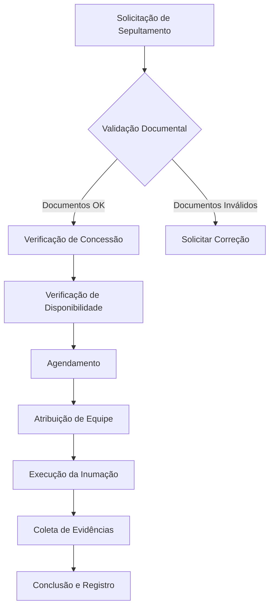
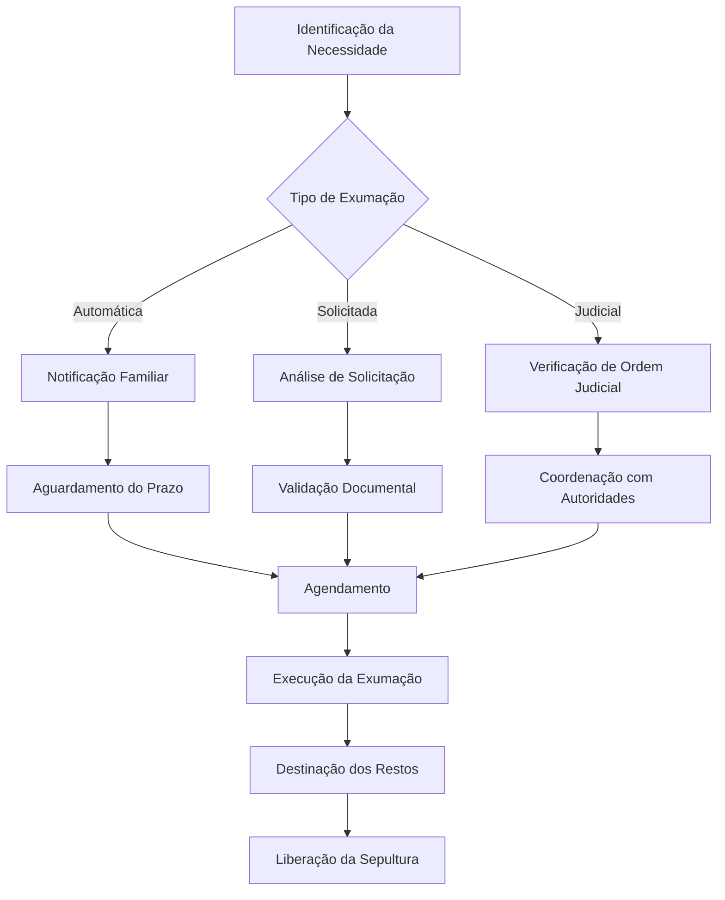
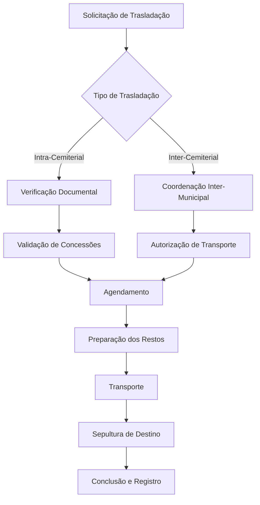
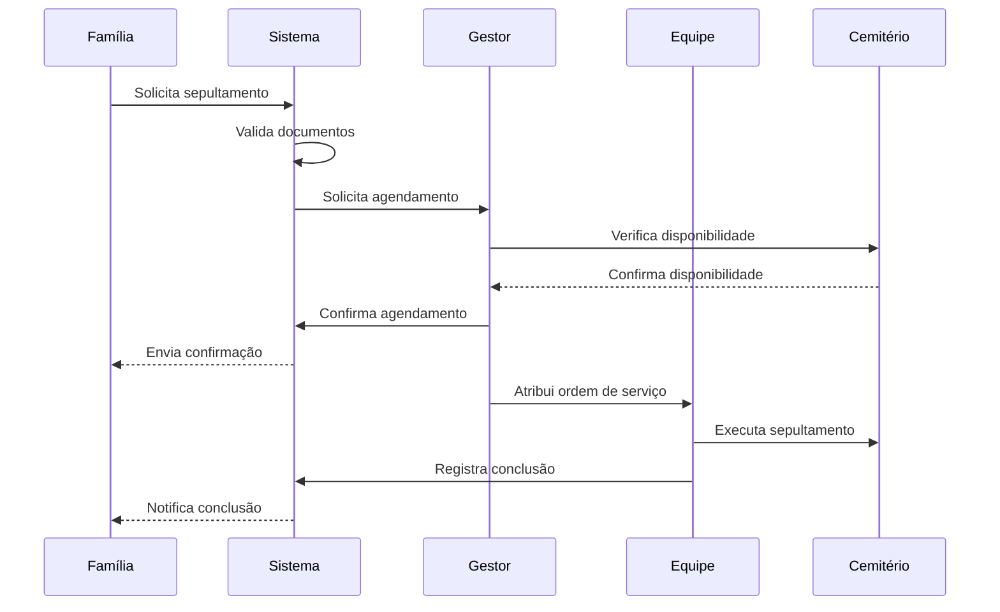
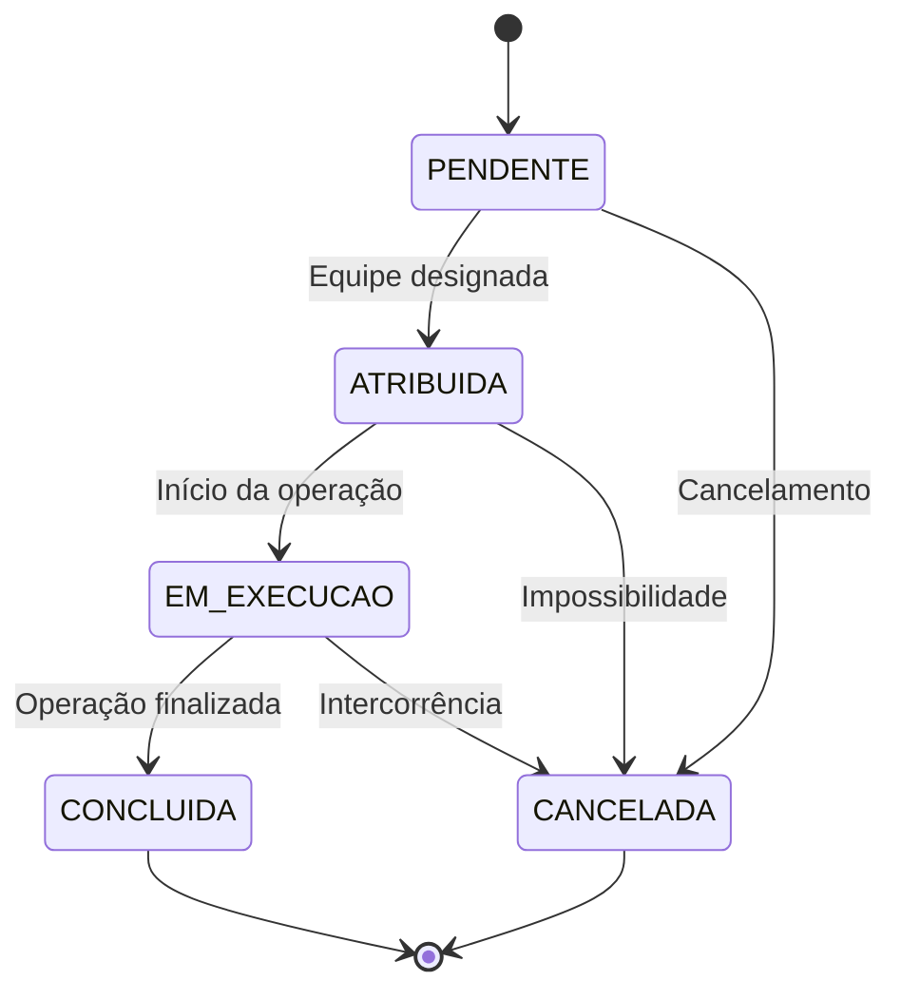
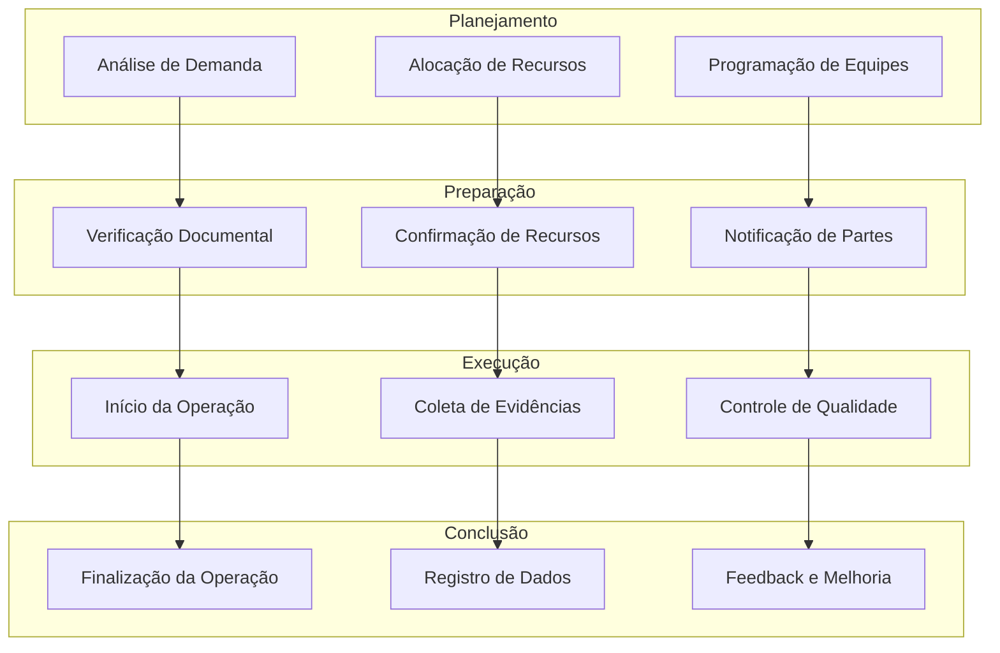

# FE-03-Operacao - Documento de Operações Cemiteriais

## Índice de Navegação

1. [Visão Geral das Operações](#1-visão-geral-das-operações)
2. [Gestão de Equipes Operacionais](#2-gestão-de-equipes-operacionais)
3. [Processos de Sepultamento](#3-processos-de-sepultamento)
4. [Processos de Exumação](#4-processos-de-exumação)
5. [Processos de Trasladação](#5-processos-de-trasladação)
6. [Ordens de Serviço](#6-ordens-de-serviço)
7. [Agendamento e Coordenação](#7-agendamento-e-coordenação)
8. [Controle de Qualidade](#8-controle-de-qualidade)
9. [Procedimentos de Segurança](#9-procedimentos-de-segurança)
10. [Integrações e Comunicação](#10-integrações-e-comunicação)
11. [Fluxogramas e Diagramas](#11-fluxogramas-e-diagramas)
12. [Referências Cruzadas](#12-referências-cruzadas)

---

## 1. Visão Geral das Operações

### 1.1 Objetivo do Documento

Este documento define os procedimentos operacionais padrão para todas as atividades realizadas nos cemitérios, garantindo eficiência, segurança e conformidade legal. A estrutura segue a arquitetura IGRP 3.0 e integra-se com os módulos BE-01-Cemiterio, BE-02-Concessao e BE-04-Financeiro.

### 1.2 Escopo das Operações

As operações cemiteriais abrangem:
- **Sepultamentos**: Inumações em sepulturas novas ou existentes
- **Exumações**: Remoção de restos mortais por diversos motivos
- **Trasladações**: Transferência de restos entre sepulturas
- **Manutenções**: Conservação e limpeza de sepulturas
- **Operações Administrativas**: Gestão de documentos e registros

### 1.3 Sistema de Hierarquia Operacional

```
Administrador Municipal
    ↓
Gestor de Cemitério
    ↓
Supervisor de Equipe
    ↓
Operadores de Campo
```

### 1.4 Horários de Operação

- **Horário Comercial**: 08:00 às 17:00 (segunda a sexta)
- **Horário Especial**: 08:00 às 12:00 (sábados)
- **Plantão**: 24 horas para emergências
- **Feriados**: Conforme calendário municipal

---

## 2. Gestão de Equipes Operacionais

### 2.1 Estrutura das Equipes

#### 2.1.1 Tipos de Equipes

**Equipe de Sepultamento (Tipo-A)**
- Supervisor (1)
- Operadores de escavação (2)
- Auxiliar de cerimônia (1)
- Especializações: Inumação, cerimônias religiosas

**Equipe de Exumação (Tipo-B)**
- Supervisor especializado (1)
- Operadores experientes (3)
- Auxiliar de documentação (1)
- Especializações: Exumação, manuseio de restos mortais

**Equipe de Trasladação (Tipo-C)**
- Supervisor (1)
- Operadores (2)
- Motorista (1)
- Especializações: Transporte, logística

**Equipe de Manutenção (Tipo-D)**
- Supervisor (1)
- Operadores de manutenção (2)
- Jardineiro (1)
- Especializações: Conservação, paisagismo

### 2.2 Capacidade Operacional

| Tipo de Equipe | Operações Simultâneas | Tempo Médio por Operação |
|----------------|----------------------|-------------------------|
| Equipe A (Sepultamento) | 1 | 120 minutos |
| Equipe B (Exumação) | 1 | 180 minutos |
| Equipe C (Trasladação) | 1 | 90 minutos |
| Equipe D (Manutenção) | 3 | 60 minutos |

### 2.3 Responsabilidades por Função

#### 2.3.1 Supervisor de Equipe
- Coordenar todas as operações da equipe
- Validar documentação antes das operações
- Garantir segurança e qualidade
- Reportar incidentes ao gestor
- Treinar novos operadores

#### 2.3.2 Operador de Campo
- Executar operações conforme procedimentos
- Coletar evidências fotográficas
- Preencher checklists digitais
- Manter equipamentos em bom estado
- Comunicar problemas ao supervisor

#### 2.3.3 Auxiliar Operacional
- Apoiar operadores nas tarefas
- Preparar materiais e equipamentos
- Auxiliar na documentação
- Manter área de trabalho organizada

### 2.4 Escala de Trabalho

#### 2.4.1 Turnos Diários
- **Manhã**: 08:00 às 12:00
- **Tarde**: 13:00 às 17:00
- **Disponibilidade**: Segunda a sábado

#### 2.4.2 Escala Semanal
```
Semana Tipo 1: Equipes A e B (sepultamento e exumação)
Semana Tipo 2: Equipes C e D (trasladação e manutenção)
Rotação quinzenal para equalizar carga de trabalho
```

---

## 3. Processos de Sepultamento

### 3.1 Fluxo de Sepultamento



### 3.2 Requisitos Documentais

#### 3.2.1 Documentos Obrigatórios
- **Certidão de Óbito** (original)
- **Autorização de Sepultamento** (municipal)
- **Documento de Identificação** do falecido
- **Comprovante de Concessão** (se aplicável)
- **Autorização Familiar** (quando necessário)

#### 3.2.2 Validação de Documentos
- Verificar autenticidade com Registro Civil
- Validar prazo de validade (72 horas)
- Confirmar identidade do falecido
- Verificar autorização municipal

### 3.3 Procedimentos de Sepultamento

#### 3.3.1 Preparação Pré-Operação
1. **Verificação de Concessão**
   - Validar vigência da concessão
   - Verificar tipo de concessão (temporária/perpétua)
   - Confirmar titularidade

2. **Inspeção da Sepultura**
   - Verificar estado físico da sepultura
   - Confirmar localização exata (GPS)
   - Avaliar necessidade de preparação especial

3. **Preparação de Equipamentos**
   - Escavadeira manual/mecânica
   - Equipamentos de segurança (EPIs)
   - Ferramentas de medição
   - Material para revestimento

#### 3.3.2 Execução da Inumação
1. **Abertura da Cova**
   - Medir dimensões conforme padrão
   - Escavar com profundidade adequada
   - Preparar base com brita/cal

2. **Posicionamento do Caixão**
   - Verificar identificação do caixão
   - Posicionar com auxílio de tiras
   - Alinhar corretamente na cova

3. **Cerimônia Religiosa** (se solicitada)
   - Respeitar tradições religiosas
   - Permitir presença de familiares
   - Manter decoro e respeito

4. **Fechamento da Cova**
   - Colocar laje de concreto (quando aplicável)
   - Revestir com terra compactada
   - Nivelar superfície

#### 3.3.3 Pós-Operação
1. **Limpeza da Área**
   - Remover excesso de terra
   - Limpar equipamentos
   - Organizar materiais

2. **Registro da Operação**
   - Preencher formulário digital
   - Anexar evidências fotográficas
   - Atualizar status no sistema

### 3.4 Checklist de Sepultamento

#### 3.4.1 Antes da Operação
- [ ] Documentação validada
- [ ] Concessão verificada
- [ ] Sepultura inspecionada
- [ ] Equipamentos preparados
- [ ] Equipe briefada

#### 3.4.2 Durante a Operação
- [ ] Procedimentos de segurança seguidos
- [ ] Evidências fotográficas coletadas
- [ ] GPS validado
- [ ] Cerimônia respeitada
- [ ] Operação documentada

#### 3.4.3 Após a Operação
- [ ] Área limpa e organizada
- [ ] Formulário preenchido
- [ ] Fotos anexadas ao sistema
- [ ] Status atualizado
- [ ] Família notificada (se aplicável)

---

## 4. Processos de Exumação

### 4.1 Tipos de Exumação

#### 4.1.1 Exumação Automática
- Por vencimento de concessão temporária
- Programada automaticamente pelo sistema
- Notificação prévia à família (30 dias)

#### 4.1.2 Exumação Solicitada
- Por solicitação da família
- Com autorização judicial (quando necessário)
- Para trasladação ou cremação

#### 4.1.3 Exumação Judicial
- Por ordem judicial
- Para investigação policial
- Com supervisão de autoridades

### 4.2 Fluxo de Exumação



### 4.3 Requisitos Legais

#### 4.3.1 Prazos Legais
- **Concessão Temporária**: 3, 5 ou 7 anos
- **Notificação Prévia**: 30 dias antes do vencimento
- **Prazo para Exumação**: 60 dias após vencimento
- **Guarda de Ossos**: 2 anos em ossário municipal

#### 4.3.2 Documentação Necessária
- **Requerimento de Exumação** (modelo padrão)
- **Autorização Sanitária** (SMS municipal)
- **Termo de Responsabilidade** (família/requerente)
- **Documento de Identidade** do requerente
- **Comprovante de Parentesco** (quando aplicável)

### 4.4 Procedimentos de Exumação

#### 4.4.1 Preparação e Segurança
1. **Vistoria Prévia**
   - Avaliar estado da sepultura
   - Verificar profundidade do túmulo
   - Identificar possíveis dificuldades

2. **Equipamentos de Proteção**
   - Máscaras PFF2/N95
   - Luvas cirúrgicas duplas
   - Aventais descartáveis
   - Óculos de proteção

3. **Delimitação da Área**
   - Isolar espaço de trabalho
   - Sinalizar área de risco
   - Controlar acesso de público

#### 4.4.2 Execução da Exumação
1. **Abertura Superficial**
   - Remover camada superior de terra
   - Identificar laje ou revestimento
   - Documentar estado com fotos

2. **Remoção de Restos**
   - Escavar com cuidado e respeito
   - Separar ossos de tecidos
   - Identificar peças anatômicas

3. **Acondicionamento**
   - Colocar restos em sacos apropriados
   - Identificar com etiquetas
   - Preparar para transporte

#### 4.4.3 Destinação dos Restos
1. **Para Ossário Municipal**
   - Transportar em veículo apropriado
   - Entregar ao responsável do ossário
   - Registrar entrada no sistema

2. **Para Trasladação**
   - Coordenar com equipe de trasladação
   - Preparar documentação de transporte
   - Acompanhar até novo local

3. **Para Cremação**
   - Agendar com crematório credenciado
   - Preparar autorizações necessárias
   - Coordenar logística de transporte

### 4.5 Checklist de Exumação

#### 4.5.1 Documentação
- [ ] Requerimento de exumação
- [ ] Autorização sanitária
- [ ] Notificação familiar (exumações automáticas)
- [ ] Documentação de destinação

#### 4.5.2 Segurança
- [ ] EPIs utilizados corretamente
- [ ] Área isolada e sinalizada
- [ ] Equipe treinada e briefada
- [ ] Materiais de contenção preparados

#### 4.5.3 Execução
- [ ] Sepultura corretamente identificada
- [ ] Procedimento executado com respeito
- [ ] Evidências fotográficas coletadas
- [ ] GPS validado
- [ ] Restos acondicionados adequadamente

---

## 5. Processos de Trasladação

### 5.1 Tipos de Trasladação

#### 5.1.1 Intra-Cemiterial
- Dentro do mesmo cemitério
- Entre sepulturas diferentes
- Sem necessidade de transporte externo

#### 5.1.2 Inter-Cemiterial
- Entre cemitérios diferentes
- Requer transporte especializado
- Necessita coordenação entre municípios

### 5.2 Fluxo de Trasladação



### 5.3 Requisitos para Trasladação

#### 5.3.1 Documentação
- **Requerimento formal** do interessado
- **Autorização da família** (quando aplicável)
- **Comprovante de concessão** da sepultura de destino
- **Autorização sanitária** para transporte
- **Termo de responsabilidade** do transporte

#### 5.3.2 Condiições da Sepultura de Destino
- Disponibilidade confirmada
- Concessão ativa e regularizada
- Compatibilidade de tamanho
- Acessibilidade verificada

### 5.4 Procedimentos de Trasladação

#### 5.4.1 Preparação
1. **Verificação de Origem**
   - Confirmar identidade da sepultura
   - Verificar estado dos restos
   - Avaliar necessidade de preparação especial

2. **Preparação para Transporte**
   - Acondicionar em caixa apropriada
   - Identificar com etiquetas
   - Preparar documentação de transporte

#### 5.4.2 Transporte
1. **Veículo Especializado**
   - Veículo adaptado para transporte de restos
   - Compartimento fechado e seguro
   - Sistema de fixação do caixão/urna

2. **Rota e Logística**
   - Planejar rota mais curta e segura
   - Evitar estradas em mau estado
   - Coordenar horários com destino

#### 5.4.3 Sepultamento no Destino
1. **Preparação da Nova Sepultura
   - Verificar conformidade
   - Preparar conforme procedimento padrão
   - Documentar com fotos

2. **Cerimônia** (se solicitada)
   - Respeitar desejos da família
   - Manter decoro e respeito
   - Permitir presença familiar

---

## 6. Ordens de Serviço

### 6.1 Geração de Ordens

#### 6.1.1 Origem das Ordens
- **Agendamentos confirmados**
- **Solicitações de emergência**
- **Exumações automáticas**
- **Manutenções programadas**

#### 6.1.2 Número de Ordem
Formato padrão: `OS-{YYYY}-{MM}-{SEQUENCIAL}`
Exemplo: `OS-2024-01-001`

### 6.2 Priorização

#### 6.2.1 Níveis de Prioridade
- **URGENTE**: Emergências (24 horas)
- **ALTA**: Sepultamentos do dia (48 horas)
- **NORMAL**: Operações programadas (7 dias)
- **BAIXA**: Manutenções preventivas (30 dias)

#### 6.2.2 Critérios de Priorização
- Data do falecimento
- Condições de conservação
- Disponibilidade de equipes
- Condições climáticas

### 6.3 Atribuição de Ordens

#### 6.3.1 Algoritmo de Atribuição
```
1. Verificar especialização necessária
2. Verificar disponibilidade de equipe
3. Verificar proximidade geográfica
4. Verificar carga de trabalho atual
5. Atribuir à equipe mais adequada
```

#### 6.3.2 Confirmação de Atendimento
- Notificação via aplicativo móvel
- Confirmação em até 30 minutos
- Início da operação no horário agendado

### 6.4 Execução e Acompanhamento

#### 6.4.1 Início da Operação
- Check-in no local (GPS)
- Validação de presença da equipe
- Confirmação de condições
- Início do cronômetro de duração

#### 6.4.2 Durante a Operação
- Atualização de status em tempo real
- Coleta de evidências
- Registro de incidentes
- Comunicação com central

#### 6.4.3 Conclusão
- Check-out no local (GPS)
- Preenchimento de checklist
- Upload de evidências
- Atualização de status final

---

## 7. Agendamento e Coordenação

### 7.1 Sistema de Agendamento

#### 7.1.1 Slots de Tempo
- **Manhã**: 08:00, 10:00, 12:00
- **Tarde**: 14:00, 16:00
- **Duração padrão**: 2 horas por operação
- **Buffer entre operações**: 30 minutos

#### 7.1.2 Disponibilidade por Cemitério
```
Capacidade máxima simultânea:
- Cemitério Central: 3 operações
- Cemitério Norte: 2 operações
- Cemitério Sul: 2 operações
```

### 7.2 Coordenação com Partes Interessadas

#### 7.2.1 Funerárias
- Confirmação de horário 24h antes
- Comunicação de mudanças
- Coordenação de logística
- Compartilhamento de documentos

#### 7.2.2 Familiares
- Notificação de agendamento
- Orientação sobre procedimentos
- Confirmação de presença
- Atendimento de necessidades especiais

#### 7.2.3 Autoridades
- Notificação de exumações
- Coordenação de inspeções
- Comunicação de irregularidades
- Solicitação de autorizações

### 7.3 Gestão de Conflitos

#### 7.3.1 Detecção de Conflitos
- Sistema automático de verificação
- Alertas de sobreposição
- Verificação de recursos compartilhados
- Validação de disponibilidade

#### 7.3.2 Resolução de Conflitos
```
1. Identificar conflito
2. Avaliar prioridades
3. Propor alternativas
4. Comunicar partes envolvidas
5. Reagendar conforme necessário
6. Confirmar novo agendamento
```

---

## 8. Controle de Qualidade

### 8.1 Métricas de Qualidade

#### 8.1.1 KPIs Principais
- **Taxa de Conclusão no Prazo**: ≥ 95%
- **Taxa de Reclamações**: ≤ 2%
- **Pontualidade das Equipes**: ≥ 90%
- **Qualidade das Evidências**: ≥ 85%

#### 8.1.2 Indicadores de Processo
- Tempo médio de operação por tipo
- Taxa de retrabalho
- Incidentes por 100 operações
- Satisfação do cliente interno

### 8.2 Checklists de Qualidade

#### 8.2.1 Checklist de Sepultamento
**Pré-Operação:**
- [ ] Documentação completa e válida
- [ ] Sepultura identificada corretamente
- [ ] Equipamentos em bom estado
- [ ] Equipe treinada e capacitada

**Durante Operação:**
- [ ] Procedimentos seguidos corretamente
- [ ] Segurança garantida
- [ ] Evidências coletadas
- [ ] GPS validado

**Pós-Operação:**
- [ ] Área limpa e organizada
- [ ] Documentação preenchida
- [ ] Fotos anexadas ao sistema
- [ ] Status atualizado

#### 8.2.2 Checklist de Exumação
**Documentação:**
- [ ] Autorização sanitária
- [ ] Notificação familiar (quando aplicável)
- [ ] Requerimento formal
- [ ] Documentação de destinação

**Segurança:**
- [ ] EPIs utilizados
- [ ] Área isolada
- [ ] Procedimentos de biossegurança
- [ ] Equipe especializada

**Execução:**
- [ ] Sepultura correta
- [ ] Procedimento respeitoso
- [ ] Restos acondicionados
- [ ] Transporte adequado

### 8.3 Auditoria de Qualidade

#### 8.3.1 Auditoria Interna
- **Frequência**: Mensal
- **Amostragem**: 10% das operações
- **Critérios**: Documentação, procedimentos, evidências
- **Responsável**: Gestor de qualidade

#### 8.3.2 Auditoria Externa
- **Frequência**: Semestral
- **Realizada por**: Empresa certificada
- **Escopo**: Sistema completo de gestão
- **Certificação**: ISO 9001

---

## 9. Procedimentos de Segurança

### 9.1 Segurança Operacional

#### 9.1.1 EPIs Obrigatórios
- Capacete de segurança
- Luvas de borracha/procedimento
- Botas de segurança
- Máscara PFF2 (exumações)
- Avental descartável

#### 9.1.2 Procedimentos de Segurança
```
Antes da Operação:
1. Briefing de segurança
2. Inspeção de equipamentos
3. Verificação de EPIs
4. Delimitação da área

Durante a Operação:
1. Manter comunicação constante
2. Seguir procedimentos estabelecidos
3. Reportar incidentes imediatamente
4. Manter área isolada

Após a Operação:
1. Limpeza de equipamentos
2. Descarte adequado de materiais
3. Lavagem das mãos
4. Descontaminação se necessário
```

### 9.2 Segurança de Documentos

#### 9.2.1 Proteção de Dados
- Criptografia de documentos digitais
- Controle de acesso por perfil
- Backup automático dos dados
- Auditoria de acessos

#### 9.2.2 Confidencialidade
- Dados pessoais protegidos (LGPD)
- Informações médicas sigilosas
- Restrição de acesso por necessidade
- Termo de confidencialidade assinado

### 9.3 Emergências e Incidentes

#### 9.3.1 Tipos de Emergência
- Acidentes com equipe
- Desabamento de terra
- Interferência de terceiros
- Condições climáticas extremas

#### 9.3.2 Procedimentos de Emergência
```
1. Avaliar gravidade da situação
2. Garantir segurança da equipe
3. Acionar serviços de emergência (se necessário)
4. Isolar área de risco
5. Notificar gestor imediatamente
6. Documentar incidente
7. Investigar causas
8. Implementar correções
```

---

## 10. Integrações e Comunicação

### 10.1 Integrações de Sistema

#### 10.1.1 Integrações Internas (RabbitMQ)
**BE-01-Cemiterio**
- Validação de disponibilidade de sepulturas
- Atualização de mapas e localização
- Controle de capacidade por cemitério

**BE-02-Concessao**
- Verificação de validade de concessões
- Atualização de status após operações
- Notificações de vencimento

**BE-04-Financeiro**
- Validação de pagamentos
- Geração de taxas operacionais
- Controle de inadimplência

#### 10.1.2 Integrações Externas
**Registro Civil**
- Validação de certidões de óbito
- Confirmação de identidade
- Verificação de registro

**Autoridades Sanitárias**
- Notificações de exumação obrigatórias
- Solicitações de autorização
- Relatórios periódicos

**Funerárias**
- Coordenação de horários
- Compartilhamento de documentos
- Atualização de status

### 10.2 Comunicação com Stakeholders

#### 10.2.1 Canais de Comunicação
- **Portal do Cidadão**: Para familiares
- **Aplicativo Móvel**: Para equipes
- **Sistema de Notificações**: Para alertas
- **Email**: Para comunicações formais
- **SMS**: Para urgências

#### 10.2.2 Protocolo de Comunicação
```
1. Identificar tipo de mensagem
2. Selecionar canal apropriado
3. Personalizar conteúdo
4. Validar destinatário
5. Enviar com confirmação
6. Registrar comunicação
7. Acompanhar resposta
```

### 10.3 Notificações Automáticas

#### 10.3.1 Tipos de Notificação
- **Confirmação de Agendamento**: Para familiares
- **Lembrete de Operação**: Para equipes
- **Alerta de Vencimento**: Para concessões
- **Conclusão de Operação**: Para solicitantes
- **Incidentes**: Para gestores

#### 10.3.2 Templates de Mensagem
**Confirmação de Sepultamento:**
```
Prezado(a) [Nome],

O sepultamento de [Nome do Falecido] está confirmado para:
Data: [Data]
Hora: [Hora]
Local: [Cemitério] - Sepultura [Número]

Equipe responsável: [Nome da Equipe]
Contato: [Telefone]

Por favor, chegar com 15 minutos de antecedência.
```

---

## 11. Fluxogramas e Diagramas

### 11.1 Diagrama de Sequência - Sepultamento



### 11.2 Diagrama de Estado - Ordem de Serviço



### 11.3 Mapa de Processos - Operações Cemiteriais



---

## 12. Referências Cruzadas

### 12.1 Documentos Relacionados

#### 12.1.1 Documentos de Backend
- **[BE-01-Cemiterio](BE-01-Cemiterio.md)**: Gestão de cemitérios e sepulturas
- **[BE-02-Concessao](BE-02-Concessao.md)**: Gestão de concessões e direitos
- **[BE-03-Operacao](BE-03-Operacao.md)**: Backend de operações (este documento)
- **[BE-04-Financeiro](BE-04-Financeiro.md)**: Gestão financeira e pagamentos

#### 12.1.2 Documentos de Frontend
- **[FE-01-Cemiterio](FE-01-Cemiterio.md)**: Interface de gestão de cemitérios
- **[FE-02-Concessao](FE-02-Concessao.md)**: Interface de gestão de concessões
- **[FE-03-Operacao](FE-03-Operacao.md)**: Interface de operações (este documento)
- **[FE-04-Financeiro](FE-04-Financeiro.md)**: Interface financeira

#### 12.1.3 Documentos de Requisitos
- **[PRD-SGC](PRD-SGC-Sistema-Gestão-Cemitérios.md)**: Requisitos do produto
- **[implementation_guide](implementation_guide.md)**: Guia de implementação
- **[project_rules](../rules/project_rules.md)**: Regras do projeto

### 12.2 Integrações Específicas

#### 12.2.1 Integração com BE-01-Cemiterio
```
Operação → Validação de Sepultura
- Verificar disponibilidade
- Confirmar localização GPS
- Validar capacidade
- Atualizar ocupação
```

#### 12.2.2 Integração com BE-02-Concessao
```
Operação → Validação de Concessão
- Verificar validade
- Confirmar titularidade
- Validar pagamentos
- Atualizar status
```

#### 12.2.3 Integração com BE-04-Financeiro
```
Operação → Validação Financeira
- Verificar pagamentos pendentes
- Gerar taxas quando aplicável
- Confirmar quitação
- Atualizar financeiro
```

### 12.3 Mapeamento de Dados

#### 12.3.1 Tabelas Principais
- **t_burials**: Registro de sepultamentos
- **t_exhumations**: Registro de exumações
- **t_transfers**: Registro de trasladações
- **t_schedules**: Agendamentos
- **t_work_orders**: Ordens de serviço
- **t_teams**: Equipes operacionais

#### 12.3.2 Relacionamentos
```
Operação → Agendamento → Ordem de Serviço → Equipe
   ↓
Evidências → Fotos → GPS → Qualidade
```

---

## Apêndices

### Apêndice A - Glossário de Termos

**Sepultamento**: Ato de depositar o corpo de uma pessoa falecida em sepultura
**Exumação**: Ato de remover restos mortais de uma sepultura
**Trasladação**: Transferência de restos mortais entre sepulturas
**Concessão**: Direito de uso de sepultura por período determinado
**OSS**: Ordem de Serviço de Sepultamento
**OS**: Ordem de Serviço geral
**PPS**: Plano de Prevenção de Sepultamentos
**EPI**: Equipamento de Proteção Individual

### Apêndice B - Formulários Padrão

Os formulários digitais estão disponíveis no sistema e incluem:
- Formulário de Sepultamento
- Formulário de Exumação
- Formulário de Trasladação
- Checklist de Qualidade
- Relatório de Incidente

### Apêndice C - Contatos Importantes

**Central de Operações**: 0800-XXX-XXXX
**Registro Civil**: [Vincular ao sistema municipal]
**Vigilância Sanitária**: [Vincular ao sistema municipal]
**Defesa Civil**: 199
**Polícia**: 190
**Samu**: 192

---

**Documento elaborado conforme arquitetura IGRP 3.0 e padrões do Sistema de Gestão Cemiterial (SGC)**

**Versão**: 2.0 - Reestruturado
**Data**: Novembro 2025
**Responsável**: Equipe de Desenvolvimento SGC
**Aprovação**: Aguardando revisão do gestor do projeto