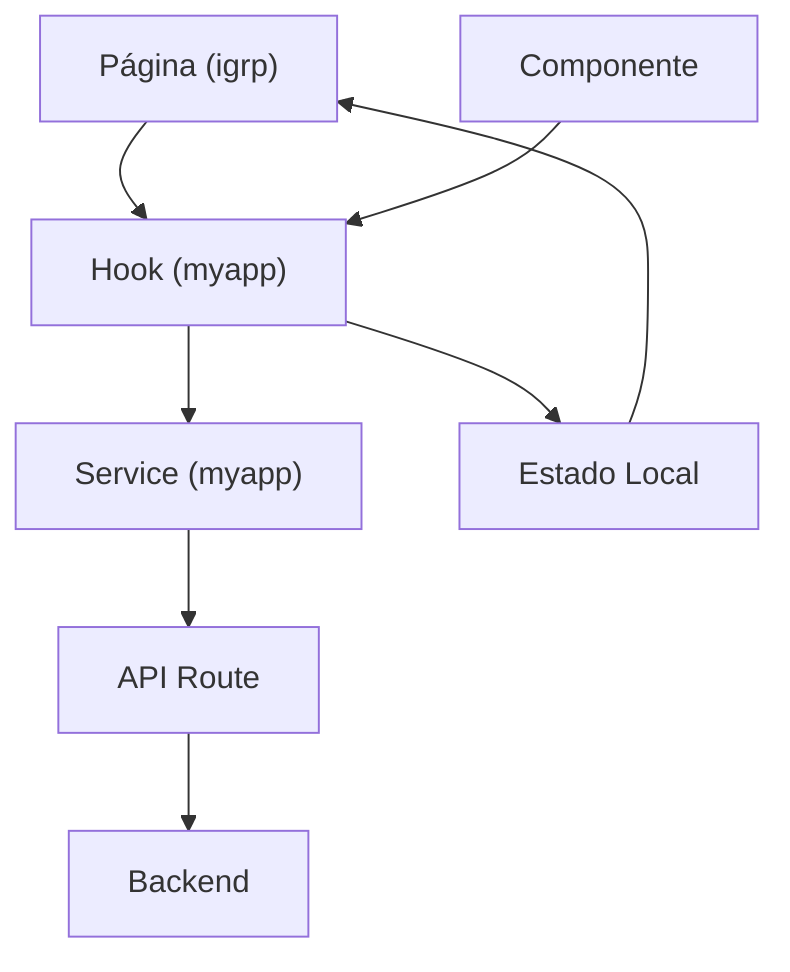

# Guia de Implementação - Arquitetura IGRP + MyApp

## 📋 Visão Geral

Este guia documenta a arquitetura recomendada para projetos **Next.js + IGRP**, que utiliza uma separação clara entre:

- **`(igrp)`**: Páginas e rotas protegidas pelo framework IGRP
- **`(myapp)`**: Bibliotecas de suporte exclusivas do negócio (actions, hooks, services, types)

Esta arquitetura promove:
- ✅ **Separação de responsabilidades** clara entre UI e lógica de negócio
- ✅ **Reutilização de código** através de hooks e services
- ✅ **Manutenibilidade** com estrutura organizada e previsível
- ✅ **Testabilidade** com camadas independentes e desacopladas

## 🏗️ Estrutura do Projeto

```
src/
├── app/
│   ├── (auth)/                    # Rotas de autenticação
│   ├── (igrp)/                    # Páginas protegidas pelo IGRP
│   │   ├── layout.tsx            # Layout com header/sidebar IGRP
│   │   ├── page.tsx              # Home page
│   │   ├── entities/             # Páginas da entidade principal
│   │   │   ├── page.tsx         # Lista de entidades
│   │   │   ├── create/          # Criar entidade
│   │   │   ├── [id]/            # Detalhes da entidade
│   │   │   │   ├── page.tsx
│   │   │   │   ├── edit/
│   │   │   │   └── sub-entities/ # Gestão de sub-entidades
│   │   │   └── analytics/       # Visualizações analíticas
│   │   └── system-settings/      # Configurações do sistema
│   │
│   ├── (myapp)/                   # Bibliotecas de negócio
│   │   ├── actions/              # Server Actions
│   │   ├── hooks/                # React Hooks customizados
│   │   │   ├── useEntity.ts
│   │   │   ├── useSubEntity.ts
│   │   │   └── useAnalytics.ts
│   │   ├── services/             # Serviços de API
│   │   │   ├── entityService.ts
│   │   │   └── subEntityService.ts
│   │   └── types/                # TypeScript types
│   │       ├── Entity.ts
│   │       ├── SubEntity.ts
│   │       ├── Analytics.ts
│   │       └── Common.ts
│   │
│   ├── api/                       # API Routes (Next.js)
│   │   └── v1/
│   │       ├── entities/
│   │       └── sub-entities/
│   │
│   └── layout.tsx                 # Root layout
│
├── components/                    # Componentes reutilizáveis
│   ├── entities/
│   │   ├── EntityList.tsx
│   │   ├── EntityCard.tsx
│   │   ├── EntityForm.tsx
│   │   └── EntityDetails.tsx
│   ├── sub-entities/
│   └── analytics/
│
├── lib/                           # Utilitários gerais
│   ├── auth-helpers.ts
│   ├── auth-options.ts
│   └── utils.ts
│
└── middleware.ts                  # Middleware de autenticação
```

## 🎯 Princípios da Arquitetura

### 1. Separação de Responsabilidades

#### `(igrp)` - Camada de Apresentação
- **Responsabilidade**: Páginas, rotas e UI
- **Conteúdo**: Apenas componentes de página e layouts
- **Dependências**: Importa de `(myapp)` e `components`
- **Não contém**: Lógica de negócio, chamadas de API diretas

#### `(myapp)` - Camada de Negócio
- **Responsabilidade**: Lógica de negócio exclusiva da aplicação
- **Conteúdo**: Hooks, services, actions, types
- **Independente**: Não importa de `(igrp)`
- **Reutilizável**: Pode ser usado em diferentes contextos

### 2. Fluxo de Dados



## 📦 Camadas da Aplicação

### Camada 1: Types (Tipos)

**Localização**: `src/app/(myapp)/types/`

Define os contratos de dados da aplicação.

```typescript
// src/app/(myapp)/types/Entity.ts
export interface Entity {
  id: string;
  code: string;
  name: string;
  status: EntityStatus;
  categoryId: number;
  // ... outros campos específicos do domínio
}

export interface EntityFormData {
  name: string;
  status: EntityStatus;
  // ... campos do formulário
}

export const EntitySchema = z.object({
  name: z.string().min(3, "Nome deve ter no mínimo 3 caracteres"),
  status: z.enum(["ACTIVE", "INACTIVE"]),
  // ... validações Zod
});

export type EntityFormData = z.infer<typeof EntitySchema>;
```

**Responsabilidades**:
- Definir interfaces TypeScript
- Criar enums e tipos auxiliares
- Schemas de validação (Zod)
- Tipos para formulários e API

### Camada 2: Services (Serviços)

**Localização**: `src/app/(myapp)/services/`

Gerencia comunicação com APIs.

```typescript
// src/app/(myapp)/services/entityService.ts
export class EntityService {
  private baseUrl: string;

  constructor() {
    this.baseUrl = process.env.NEXT_PUBLIC_API_URL || "/api/v1";
  }

  /**
   * Busca todas as entidades com filtros opcionais
   * @param params - Parâmetros de busca e paginação
   * @returns Promise com resposta paginada de entidades
   */
  async getAll(params?: EntitySearchParams): Promise<PaginatedResponse<Entity>> {
    const searchParams = new URLSearchParams(params as any);
    return this.fetchWithErrorHandling<PaginatedResponse<Entity>>(
      `${this.baseUrl}/entities?${searchParams.toString()}`
    );
  }

  /**
   * Busca uma entidade por ID
   * @param id - ID da entidade
   * @returns Promise com a entidade encontrada
   */
  async getById(id: string): Promise<Entity> {
    return this.fetchWithErrorHandling<Entity>(
      `${this.baseUrl}/entities/${id}`
    );
  }

  /**
   * Cria uma nova entidade
   * @param data - Dados do formulário de criação
   * @returns Promise com a entidade criada
   */
  async create(data: EntityFormData): Promise<Entity> {
    return this.fetchWithErrorHandling<Entity>(
      `${this.baseUrl}/entities`,
      { 
        method: "POST", 
        headers: { "Content-Type": "application/json" },
        body: JSON.stringify(data) 
      }
    );
  }

  /**
   * Atualiza uma entidade existente
   * @param id - ID da entidade
   * @param data - Dados do formulário de atualização
   * @returns Promise com a entidade atualizada
   */
  async update(id: string, data: EntityFormData): Promise<Entity> {
    return this.fetchWithErrorHandling<Entity>(
      `${this.baseUrl}/entities/${id}`,
      { 
        method: "PUT", 
        headers: { "Content-Type": "application/json" },
        body: JSON.stringify(data) 
      }
    );
  }

  /**
   * Remove uma entidade
   * @param id - ID da entidade a ser removida
   * @returns Promise void
   */
  async delete(id: string): Promise<void> {
    return this.fetchWithErrorHandling<void>(
      `${this.baseUrl}/entities/${id}`,
      { method: "DELETE" }
    );
  }

  /**
   * Método auxiliar para fazer requisições com tratamento de erros
   */
  private async fetchWithErrorHandling<T>(url: string, options?: RequestInit): Promise<T> {
    const response = await fetch(url, options);
    
    if (!response.ok) {
      const errorData = await response.json().catch(() => ({}));
      throw new Error(errorData.message || `HTTP error! status: ${response.status}`);
    }
    
    return response.json();
  }
}
```

**Responsabilidades**:
- Encapsular chamadas HTTP
- Gerenciar headers e autenticação
- Transformar dados entre frontend/backend
- Tratamento de erros de rede

### Camada 3: Hooks (React Hooks)

**Localização**: `src/app/(myapp)/hooks/`

Gerencia estado e lógica de negócio.

```typescript
// src/app/(myapp)/hooks/useEntity.ts
import { useState, useCallback } from "react";
import { EntityService } from "@/app/(myapp)/services/entityService";
import type { Entity, EntityFormData, EntitySearchParams } from "@/app/(myapp)/types/Entity";

/**
 * Hook customizado para gerenciar operações CRUD de entidades
 * @returns Objeto com estado e funções para manipular entidades
 */
export function useEntity() {
  const [entities, setEntities] = useState<Entity[]>([]);
  const [selectedEntity, setSelectedEntity] = useState<Entity | null>(null);
  const [isLoading, setIsLoading] = useState(false);
  const [error, setError] = useState<Error | null>(null);

  const entityService = new EntityService();

  /**
   * Busca todas as entidades com filtros opcionais
   */
  const fetchEntities = useCallback(async (params?: EntitySearchParams) => {
    setIsLoading(true);
    setError(null);
    try {
      const response = await entityService.getAll(params);
      setEntities(response.content);
    } catch (err) {
      const error = err instanceof Error ? err : new Error("Falha ao buscar entidades");
      setError(error);
    } finally {
      setIsLoading(false);
    }
  }, []);

  /**
   * Busca uma entidade por ID
   */
  const getEntityById = useCallback(async (id: string) => {
    setIsLoading(true);
    setError(null);
    try {
      const entity = await entityService.getById(id);
      setSelectedEntity(entity);
      return entity;
    } catch (err) {
      const error = err instanceof Error ? err : new Error("Falha ao buscar entidade");
      setError(error);
      return null;
    } finally {
      setIsLoading(false);
    }
  }, []);

  /**
   * Cria uma nova entidade
   */
  const createEntity = useCallback(async (data: EntityFormData) => {
    setIsLoading(true);
    setError(null);
    try {
      const newEntity = await entityService.create(data);
      setEntities(prev => [...prev, newEntity]);
      return newEntity;
    } catch (err) {
      const error = err instanceof Error ? err : new Error("Falha ao criar entidade");
      setError(error);
      throw error;
    } finally {
      setIsLoading(false);
    }
  }, []);

  /**
   * Atualiza uma entidade existente
   */
  const updateEntity = useCallback(async (id: string, data: EntityFormData) => {
    setIsLoading(true);
    setError(null);
    try {
      const updatedEntity = await entityService.update(id, data);
      setEntities(prev => prev.map(e => e.id === id ? updatedEntity : e));
      return updatedEntity;
    } catch (err) {
      const error = err instanceof Error ? err : new Error("Falha ao atualizar entidade");
      setError(error);
      throw error;
    } finally {
      setIsLoading(false);
    }
  }, []);

  /**
   * Remove uma entidade
   */
  const deleteEntity = useCallback(async (id: string) => {
    setIsLoading(true);
    setError(null);
    try {
      await entityService.delete(id);
      setEntities(prev => prev.filter(e => e.id !== id));
    } catch (err) {
      const error = err instanceof Error ? err : new Error("Falha ao remover entidade");
      setError(error);
      throw error;
    } finally {
      setIsLoading(false);
    }
  }, []);

  return {
    entities,
    selectedEntity,
    isLoading,
    error,
    fetchEntities,
    getEntityById,
    createEntity,
    updateEntity,
    deleteEntity,
  };
}
```

**Responsabilidades**:
- Gerenciar estado da aplicação
- Orquestrar chamadas aos services
- Fornecer interface limpa para componentes
- Implementar lógica de negócio complexa

### Camada 4: Components (Componentes)

**Localização**: `src/components/`

Componentes reutilizáveis de UI.

```typescript
// src/components/entities/EntityList.tsx
"use client";

import { useEffect } from "react";
import { useEntity } from "@/app/(myapp)/hooks/useEntity";
import { IGRPDataTable, LoadingSpinner, ErrorMessage } from "@igrp/igrp-framework-react-design-system";

export function EntityList() {
  const { entities, isLoading, error, fetchEntities } = useEntity();

  useEffect(() => {
    fetchEntities();
  }, [fetchEntities]);

  if (isLoading) return <LoadingSpinner />;
  if (error) return <ErrorMessage error={error.message} />;

  return (
    <IGRPDataTable
      data={entities}
      columns={columns}
    />
  );
}
```

**Responsabilidades**:
- Renderizar UI
- Consumir hooks
- Gerenciar interações do usuário
- Apresentar dados

### Camada 5: Pages (Páginas)

**Localização**: `src/app/(igrp)/`

Páginas da aplicação com roteamento Next.js.

```typescript
// src/app/(igrp)/entities/page.tsx
import Link from "next/link";
import { IGRPPageHeader, IGRPButton } from "@igrp/igrp-framework-react-design-system";
import { EntityList } from "@/components/entities/EntityList";

export default function EntitiesPage() {
  return (
    <div className="container mx-auto p-6">
      <IGRPPageHeader
        title="Gestão de Entidades"
        description="Gerencie as entidades do sistema"
      >
        <Link href="/entities/create">
          <IGRPButton>Nova Entidade</IGRPButton>
        </Link>
      </IGRPPageHeader>

      <EntityList />
    </div>
  );
}
```

**Responsabilidades**:
- Compor layout da página
- Integrar componentes
- Definir estrutura de navegação
- Aplicar layout IGRP

## 🔄 Padrões de Implementação

### Padrão 1: Criar Nova Funcionalidade

#### Passo 1: Definir Types

```typescript
// src/app/(myapp)/types/NewFeature.ts
export interface NewFeature {
  id: string;
  name: string;
  // ... campos
}

export const NewFeatureSchema = z.object({
  name: z.string().min(3),
  // ... validações
});

export type NewFeatureFormData = z.infer<typeof NewFeatureSchema>;
```

#### Passo 2: Criar Service

```typescript
// src/app/(myapp)/services/newFeatureService.ts
export class NewFeatureService {
  private baseUrl = "/api/v1";

  async getAll(): Promise<NewFeature[]> {
    const response = await fetch(`${this.baseUrl}/new-features`);
    if (!response.ok) throw new Error("Falha ao buscar dados");
    return response.json();
  }

  async create(data: NewFeatureFormData): Promise<NewFeature> {
    const response = await fetch(`${this.baseUrl}/new-features`, {
      method: "POST",
      headers: { "Content-Type": "application/json" },
      body: JSON.stringify(data)
    });
    if (!response.ok) throw new Error("Falha ao criar");
    return response.json();
  }
}
```

#### Passo 3: Criar Hook

```typescript
// src/app/(myapp)/hooks/useNewFeature.ts
export function useNewFeature() {
  const [items, setItems] = useState<NewFeature[]>([]);
  const [isLoading, setIsLoading] = useState(false);
  
  const service = new NewFeatureService();

  const fetchItems = useCallback(async () => {
    setIsLoading(true);
    const data = await service.getAll();
    setItems(data);
    setIsLoading(false);
  }, []);

  return { items, isLoading, fetchItems };
}
```

#### Passo 4: Criar Componente

```typescript
// src/components/new-feature/NewFeatureList.tsx
"use client";

export function NewFeatureList() {
  const { items, isLoading, fetchItems } = useNewFeature();

  useEffect(() => {
    fetchItems();
  }, [fetchItems]);

  return <div>{/* UI */}</div>;
}
```

#### Passo 5: Criar Página

```typescript
// src/app/(igrp)/new-feature/page.tsx
export default function NewFeaturePage() {
  return (
    <div>
      <IGRPPageHeader title="Nova Funcionalidade" />
      <NewFeatureList />
    </div>
  );
}
```

### Padrão 2: Integração com React Query (Opcional)

Para funcionalidades que requerem cache avançado e sincronização de estado:

```typescript
// src/app/(myapp)/hooks/useEntity.ts (com React Query)
import { useQuery, useMutation, useQueryClient } from "@tanstack/react-query";
import { EntityService } from "@/app/(myapp)/services/entityService";
import type { Entity, EntityFormData } from "@/app/(myapp)/types/Entity";

export function useEntity() {
  const queryClient = useQueryClient();
  const service = new EntityService();

  // Query para buscar todas as entidades
  const { data: entities, isLoading, error } = useQuery({
    queryKey: ["entities"],
    queryFn: () => service.getAll(),
  });

  // Mutation para criar entidade
  const createMutation = useMutation({
    mutationFn: (data: EntityFormData) => service.create(data),
    onSuccess: () => {
      queryClient.invalidateQueries({ queryKey: ["entities"] });
    },
  });

  // Mutation para atualizar entidade
  const updateMutation = useMutation({
    mutationFn: ({ id, data }: { id: string; data: EntityFormData }) => 
      service.update(id, data),
    onSuccess: () => {
      queryClient.invalidateQueries({ queryKey: ["entities"] });
    },
  });

  // Mutation para deletar entidade
  const deleteMutation = useMutation({
    mutationFn: (id: string) => service.delete(id),
    onSuccess: () => {
      queryClient.invalidateQueries({ queryKey: ["entities"] });
    },
  });

  return {
    entities: entities?.content ?? [],
    isLoading,
    error,
    createEntity: createMutation.mutate,
    updateEntity: updateMutation.mutate,
    deleteEntity: deleteMutation.mutate,
  };
}
```

## 🛠️ Boas Práticas

### 1. Nomenclatura

- **Types**: PascalCase - `Entity`, `EntityFormData`, `EntityStatus`
- **Services**: PascalCase com sufixo `Service` - `EntityService`, `AuthService`
- **Hooks**: camelCase com prefixo `use` - `useEntity`, `useAuth`
- **Componentes**: PascalCase - `EntityList`, `EntityForm`
- **Arquivos**: 
  - Types: PascalCase - `Entity.ts`
  - Services: camelCase - `entityService.ts`
  - Hooks: camelCase - `useEntity.ts`
  - Componentes: PascalCase - `EntityList.tsx`

### 2. Organização de Imports

```typescript
// 1. Imports externos
import { useState, useCallback } from "react";
import { z } from "zod";

// 2. Imports do IGRP
import { IGRPButton, IGRPCard } from "@igrp/igrp-framework-react-design-system";

// 3. Imports de (myapp)
import { useEntity } from "@/app/(myapp)/hooks/useEntity";
import type { Entity } from "@/app/(myapp)/types/Entity";

// 4. Imports de components
import { EntityCard } from "@/components/entities/EntityCard";

// 5. Imports relativos
import { helper } from "./helper";
```

### 3. Tratamento de Erros

```typescript
// Service
async getById(id: string): Promise<Entity> {
  const response = await fetch(`${this.baseUrl}/entities/${id}`);
  
  if (!response.ok) {
    const errorData = await response.json().catch(() => ({}));
    throw new Error(errorData.message || `HTTP error! status: ${response.status}`);
  }
  
  return response.json();
}

// Hook
const getEntityById = useCallback(async (id: string) => {
  setIsLoading(true);
  setError(null);
  try {
    const entity = await entityService.getById(id);
    setSelectedEntity(entity);
    return entity;
  } catch (err) {
    const error = err instanceof Error ? err : new Error("Falha ao buscar entidade");
    setError(error);
    return null;
  } finally {
    setIsLoading(false);
  }
}, []);

// Componente
useEffect(() => {
  if (error) {
    igrpToast({
      title: "Erro",
      description: error.message,
      type: "error",
    });
  }
}, [error, igrpToast]);
```

### 4. TypeScript Strict Mode

```typescript
// ✅ BOM - Tipos explícitos
const [entities, setEntities] = useState<Entity[]>([]);
const [error, setError] = useState<Error | null>(null);
const [isLoading, setIsLoading] = useState<boolean>(false);

// ❌ EVITAR - Tipos implícitos
const [entities, setEntities] = useState([]);
const [error, setError] = useState(null);
```

### 5. Comentários em Nível de Função

```typescript
/**
 * Busca todas as entidades com filtros opcionais
 * @param params - Parâmetros de busca e paginação
 * @returns Promise com resposta paginada de entidades
 * @throws Error se a requisição falhar
 */
async getAll(params?: EntitySearchParams): Promise<PaginatedResponse<Entity>> {
  const searchParams = new URLSearchParams(params as any);
  return this.fetchWithErrorHandling<PaginatedResponse<Entity>>(
    `${this.baseUrl}/entities?${searchParams.toString()}`
  );
}
```

## 📝 Checklist de Implementação

### Nova Funcionalidade

- [ ] Criar types em `(myapp)/types/`
- [ ] Criar service em `(myapp)/services/`
- [ ] Criar hook em `(myapp)/hooks/`
- [ ] Criar componentes em `components/`
- [ ] Criar páginas em `(igrp)/`
- [ ] Adicionar rotas de API se necessário
- [ ] Implementar tratamento de erros
- [ ] Adicionar validação de formulários (Zod)
- [ ] Testar fluxo completo
- [ ] Documentar funcionalidade

### Refatoração de Código Existente

- [ ] Identificar lógica de negócio em componentes
- [ ] Extrair para hooks em `(myapp)/hooks/`
- [ ] Mover chamadas de API para services
- [ ] Atualizar imports nos componentes
- [ ] Verificar tipos TypeScript
- [ ] Testar funcionalidade após refatoração

## 🔍 Exemplos Práticos

### Exemplo 1: CRUD Completo

```typescript
// 1. Types
// src/app/(myapp)/types/Entity.ts
export interface Entity { /* ... */ }
export type EntityFormData = z.infer<typeof EntitySchema>;

// 2. Service
// src/app/(myapp)/services/entityService.ts
export class EntityService {
  async getAll(): Promise<PaginatedResponse<Entity>> { /* ... */ }
  async getById(id: string): Promise<Entity> { /* ... */ }
  async create(data: EntityFormData): Promise<Entity> { /* ... */ }
  async update(id: string, data: EntityFormData): Promise<Entity> { /* ... */ }
  async delete(id: string): Promise<void> { /* ... */ }
}

// 3. Hook
// src/app/(myapp)/hooks/useEntity.ts
export function useEntity() {
  return {
    entities,
    isLoading,
    error,
    fetchEntities,
    getEntityById,
    createEntity,
    updateEntity,
    deleteEntity,
  };
}

// 4. Componente de Lista
// src/components/entities/EntityList.tsx
export function EntityList() {
  const { entities, isLoading, fetchEntities, deleteEntity } = useEntity();
  // ... implementação
}

// 5. Componente de Formulário
// src/components/entities/EntityForm.tsx
export function EntityForm({ entityId }: { entityId?: string }) {
  const { createEntity, updateEntity, getEntityById } = useEntity();
  // ... implementação com react-hook-form + zod
}

// 6. Página de Lista
// src/app/(igrp)/entities/page.tsx
export default function EntitiesPage() {
  return (
    <div>
      <IGRPPageHeader title="Entidades" />
      <EntityList />
    </div>
  );
}

// 7. Página de Criação
// src/app/(igrp)/entities/create/page.tsx
export default function CreateEntityPage() {
  return (
    <div>
      <IGRPPageHeader title="Nova Entidade" />
      <EntityForm />
    </div>
  );
}

// 8. Página de Edição
// src/app/(igrp)/entities/[id]/edit/page.tsx
export default function EditEntityPage({ params }: { params: { id: string } }) {
  return (
    <div>
      <IGRPPageHeader title="Editar Entidade" />
      <EntityForm entityId={params.id} />
    </div>
  );
}
```

## 🚀 Próximos Passos

Ao implementar esta arquitetura em seu projeto:

1. **Adaptar a estrutura** para o domínio específico do seu negócio
2. **Definir types** para todas as entidades principais
3. **Criar services** para comunicação com APIs
4. **Implementar hooks** para gerenciamento de estado
5. **Desenvolver componentes** reutilizáveis
6. **Adicionar testes** para services e hooks
7. **Documentar APIs** internas e padrões específicos do projeto
8. **Considerar Server Actions** em `(myapp)/actions/` quando necessário
9. **Configurar React Query** se precisar de cache avançado

## 📚 Recursos Adicionais

- [Next.js 15 Documentation](https://nextjs.org/docs)
- [IGRP Framework](https://github.com/NOSiCode-CV/IGRP-Framework)
- [React Query](https://tanstack.com/query/latest)
- [Zod Validation](https://zod.dev)
- [TypeScript Best Practices](https://www.typescriptlang.org/docs/handbook/declaration-files/do-s-and-don-ts.html)
- [React Hook Form](https://react-hook-form.com/)

---

**Guia Genérico de Implementação** - Adaptável a qualquer domínio de negócio
