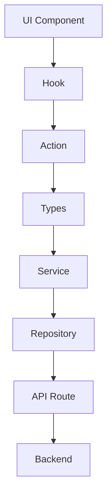

# Project Component Rules

## IGRP Framework React Design System

1. All components must use the @igrp/igrp-framework-react-design-system library
   - Import components from @igrp/igrp-framework-react-design-system
   - Do not create duplicate components that already exist in the design system
   - Follow the design system's component API and props

2. Component Usage Guidelines
   - Use the design system's components as the primary building blocks
   - Maintain consistency with the IGRP design language
   - Follow the component documentation for proper implementation

3. Prohibited Practices
   - No custom components that replicate existing design system components
   - No direct styling that overrides design system defaults without approval
   - No third-party UI components that conflict with the design system

4. Exceptions
   - Custom components are allowed only when the design system doesn't provide the needed functionality
   - Must get approval for any deviation from design system standards

## SOLID Principles

1. Single Responsibility Principle (SRP)
   - Each component should have only one reason to change
   - Components should be focused and cohesive
   - Break down complex components into smaller, focused ones

2. Open/Closed Principle (OCP)
   - Components should be open for extension but closed for modification
   - Use composition and props to extend functionality
   - Avoid modifying existing component code directly

3. Liskov Substitution Principle (LSP)
   - Child components should be substitutable for their parent components
   - Maintain consistent props and behavior patterns
   - Follow the design system's component hierarchy

4. Interface Segregation Principle (ISP)
   - Keep component interfaces small and specific
   - Don't force components to implement unnecessary props
   - Split large interfaces into smaller, focused ones

5. Dependency Inversion Principle (DIP)
   - Depend on abstractions, not concrete implementations
   - Use dependency injection through props
   - Keep components loosely coupled

## Clean Code Practices

1. Naming Conventions
   - Use clear, descriptive names for components, props, and functions
   - Follow consistent naming patterns
   - Avoid abbreviations and unclear acronyms

2. Component Organization
   - Keep components small and focused
   - Maximum of 200-300 lines per component
   - Extract reusable logic into custom hooks

3. Code Formatting
   - Follow consistent indentation and spacing
   - Use proper line breaks for readability
   - Implement automated code formatting tools

4. Documentation
   - Document component APIs and usage
   - Include JSDoc comments for complex logic
   - Maintain up-to-date README files

5. Testing
   - Write unit tests for components
   - Include integration tests for complex interactions
   - Maintain high test coverage

6. Error Handling
   - Implement proper error boundaries
   - Use meaningful error messages
   - Handle edge cases appropriately

7. Performance
   - Optimize component renders
   - Implement proper memoization
   - Follow React best practices for performance

## Primitive Components

1. IGRP Design System Components Only
   - Always use primitive components from @igrp/igrp-framework-react-design-system
   - This includes but is not limited to:
     - Buttons
     - Inputs
     - Typography
     - Icons
     - Layout components
     - Form elements
   - Never create custom primitive components

2. Implementation Guidelines
   - Import primitive components directly from the design system
   - Use the components as provided without modification
   - Follow the design system's component API documentation
   - Maintain consistent component behavior across the application

3. Prohibited Practices
   - No custom implementations of primitive components
   - No third-party primitive components
   - No direct HTML elements when a design system equivalent exists
   - No styling overrides of primitive component base styles

4. Exceptions
   - Must obtain explicit approval for any deviation
   - Document any approved exceptions thoroughly
   - Consider proposing new primitive components to the design system team

## TypeScript Guidelines

1. Type Safety
   - Use /_ eslint-disable @typescript-eslint/no-explicit-any _/ when necessary to handle any types
   - Place the disable comment at the top of files where needed
   - Document why the any type is required in those cases
   - Try to minimize usage of any by using proper type definitions

Perfeito 🚀 — vou criar um **documento em formato Markdown (`.md`)** que pode ser usado como **guideline oficial de um projeto Next.js** com a arquitetura que descrevemos, incluindo a integração de **hooks**.

## 📂 Estrutura de Camadas

O projeto deve respeitar a seguinte organização em camadas:

1. **UI Components (`/components`)**

   * Contêm a camada visual (formularios, botões, tabelas).
   * Devem ser **stateless** sempre que possível, delegando lógica para hooks.
   * Exemplo: `GeneralForm.tsx`.

2. **Hooks (`/hooks`)**

   * Encapsulam lógica de estado e efeitos colaterais.
   * Facilitam a reutilização de lógica em múltiplos componentes.
   * Exemplo: `useUser.ts`, `useFormHandler.ts`.

3. **Actions (`/actions`)**

   * Responsáveis por disparar requisições assíncronas e tratar interações da UI.
   * Podem chamar **services** ou diretamente **server actions** do Next.js.
   * Exemplo: `submitUserAction.ts`.

4. **Types (`/types`)**

   * Definições de interfaces e tipagens TypeScript.
   * Garantem consistência entre UI, serviços e backend.
   * Exemplo: `User.ts`.

5. **Services (`/services`)**

   * Implementam a lógica de negócio do frontend.
   * Chamam repositórios, formatam dados e retornam para actions/hooks.
   * Exemplo: `userService.ts`.

6. **Repository (`/repositories`)**

   * Camada de acesso a dados.
   * Encapsula chamadas a APIs externas, base de dados (quando aplicável) ou cache.
   * Exemplo: `userRepository.ts`.

7. **API Routes (`/app/api/.../route.ts`)**

   * Endpoints HTTP internos da aplicação.
   * Devem validar input, tratar erros e encaminhar chamadas para **services**.
   * Exemplo: `/app/api/users/route.ts`.

8. **Backend (microserviços ou integrações externas)**

   * Camada final de processamento.
   * Pode envolver bancos de dados, autenticação ou integrações externas.

---

## 🔄 Fluxo de Requisição

---

## ✅ Boas Práticas

* **UI Components**

  * Devem ser **declarativos** e reutilizáveis.
  * Evitar lógica de negócio diretamente no componente.

* **Hooks**

  * Sempre usar para **estado local** e **efeitos colaterais**.
  * Nomear como `useXxx` (ex.: `useAuth`, `useUsers`).

* **Actions**

  * Centralizar chamadas assíncronas que partem da UI.
  * Tratar erros e estados (`loading`, `success`, `error`).

* **Types**

  * Todos os dados compartilhados entre camadas devem ser tipados.
  * Preferir `interface` a `type` quando possível.

* **Services**

  * Devem conter **lógica de negócio** (ex.: validação, transformação de dados).
  * Não devem manipular estado da UI.

* **Repositories**

  * Não incluir lógica de negócio, apenas **acesso a dados**.
  * Separar responsabilidades: um repositório por entidade.

* **API Routes**

  * Implementar validações de entrada e saída.
  * Tratar exceções de forma centralizada usando `try-catch` e retornar erros consistentes.

## 🚨 Convenções de Código

* Usar **TypeScript** sempre que possível.
* Nomear arquivos em **camelCase** (ex.: `userService.ts`).
* Nomear componentes React em **PascalCase** (ex.: `UserList.tsx`).
* Hooks sempre com prefixo `use` (ex.: `useUser`, `useFormHandler`).
* API Routes sempre em **lowercase** (ex.: `/api/users`).

